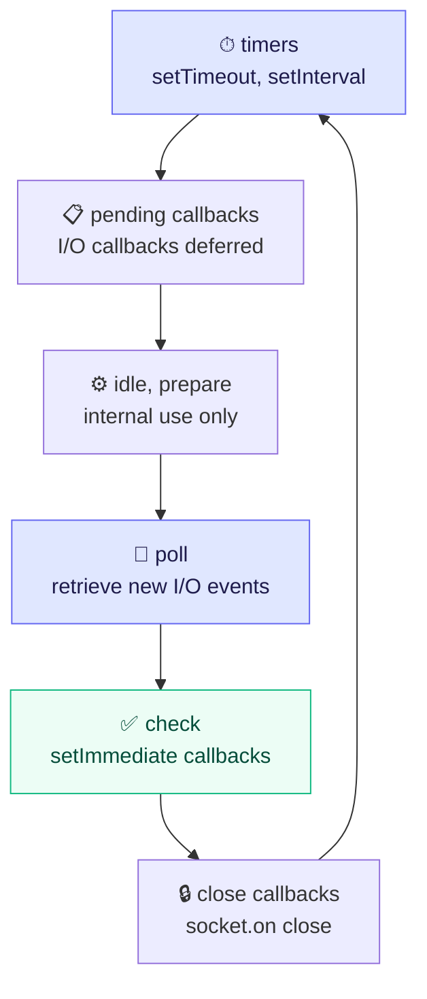
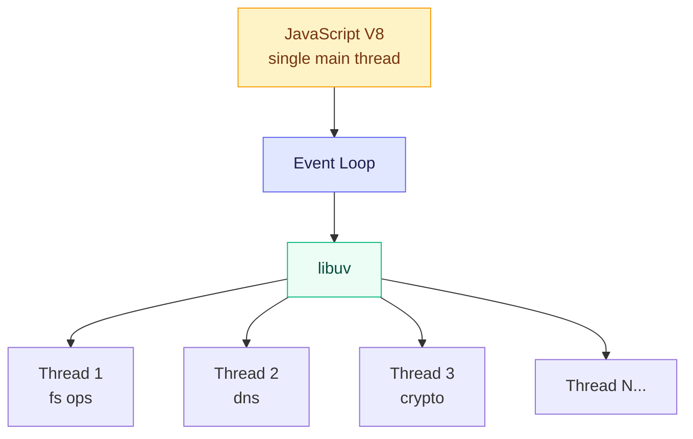

# Node.js — Complete Guide

## Table of Contents

- [1. What is Node.js?](#1-what-is-nodejs)
- [2. Architecture](#2-architecture)
- [3. Modules](#3-modules)
- [4. File System](#4-file-system)
- [5. HTTP Server](#5-http-server)
- [6. Streams](#6-streams)
- [7. Events](#7-events)
- [8. Process and Environment](#8-process-and-environment)
- [9. Buffers](#9-buffers)
- [10. Child Processes and Worker Threads](#10-child-processes-and-worker-threads)
- [11. Error Handling](#11-error-handling)
- [12. Package Management (npm)](#12-package-management-npm)
- [13. Performance and Best Practices](#13-performance-and-best-practices)
- [14. Interview Questions & Answers](#14-interview-questions--answers)
- [15. Tricky Output Questions](#15-tricky-output-questions)

---

## 1. What is Node.js?

Node.js is a **JavaScript runtime** built on Chrome's **V8 engine** that executes JavaScript outside the browser. It uses an **event-driven, non-blocking I/O** model that makes it efficient for building scalable network applications.

Key characteristics:
- **Single-threaded** event loop (with background thread pool for I/O)
- **Non-blocking I/O** — async operations don't block the main thread
- **V8 engine** — same engine that powers Chrome
- **Cross-platform** — runs on Windows, macOS, Linux
- **NPM** — largest package ecosystem in the world

### When to use Node.js

| Good for | Not ideal for |
|----------|---------------|
| REST APIs / GraphQL | CPU-intensive computation |
| Real-time apps (chat, gaming) | Heavy image/video processing |
| Microservices | Complex mathematical calculations |
| Streaming data | Monolithic enterprise apps (debatable) |
| CLI tools | |
| Server-side rendering | |

---

## 2. Architecture

### 2.1 Event Loop

The event loop is the core of Node.js. It allows non-blocking I/O despite JavaScript being single-threaded.



> **Microtask queue** runs BETWEEN each phase: `process.nextTick` (highest priority), then Promise callbacks.

### 2.2 libuv and Thread Pool



> Default: **4 threads** (configurable via `UV_THREADPOOL_SIZE`)

- **Main thread**: Runs JavaScript, event loop
- **Thread pool** (libuv): Handles I/O operations that can't be done asynchronously by the OS (fs, DNS lookups, some crypto)
- **OS async mechanisms**: Network I/O (epoll/kqueue/IOCP) — doesn't use thread pool

### 2.3 Execution Order

```js
console.log('1 - sync');

process.nextTick(() => console.log('2 - nextTick'));

Promise.resolve().then(() => console.log('3 - promise'));

setTimeout(() => console.log('4 - setTimeout'), 0);

setImmediate(() => console.log('5 - setImmediate'));

console.log('6 - sync');

// Output: 1, 6, 2, 3, 4, 5
// (setTimeout vs setImmediate order can vary outside I/O cycle)
```

---

## 3. Modules

### 3.1 CommonJS (CJS) — Traditional Node.js

```js
// math.js — export
function add(a, b) { return a + b; }
function subtract(a, b) { return a - b; }

module.exports = { add, subtract };
// or
exports.add = add;

// app.js — import
const { add, subtract } = require('./math');
const fs = require('fs');
const express = require('express');
```

### 3.2 ES Modules (ESM) — Modern

```js
// math.mjs (or .js with "type": "module" in package.json)
export function add(a, b) { return a + b; }
export default function multiply(a, b) { return a * b; }

// app.mjs
import multiply, { add } from './math.mjs';
import { readFile } from 'fs/promises';
```

### 3.3 CJS vs ESM

| Feature | CommonJS | ES Modules |
|---------|----------|------------|
| Syntax | `require()` / `module.exports` | `import` / `export` |
| Loading | Synchronous | Asynchronous |
| Top-level await | No | Yes |
| Tree-shaking | No | Yes |
| `__dirname` / `__filename` | Available | Must use `import.meta.url` |
| Default in Node | Yes (legacy) | Yes (modern, with `"type": "module"`) |

### 3.4 Built-in Modules

```js
const fs = require('fs');           // File system
const path = require('path');       // Path manipulation
const http = require('http');       // HTTP server/client
const https = require('https');     // HTTPS
const os = require('os');           // OS info
const crypto = require('crypto');   // Cryptography
const events = require('events');   // Event emitter
const stream = require('stream');   // Streams
const url = require('url');         // URL parsing
const util = require('util');       // Utilities
const child_process = require('child_process'); // Child processes
const worker_threads = require('worker_threads'); // Worker threads
const cluster = require('cluster'); // Clustering
```

---

## 4. File System

### 4.1 Reading Files

```js
const fs = require('fs');
const fsp = require('fs/promises');

// Synchronous (blocks event loop - avoid in servers)
const data = fs.readFileSync('file.txt', 'utf8');

// Callback-based
fs.readFile('file.txt', 'utf8', (err, data) => {
  if (err) throw err;
  console.log(data);
});

// Promise-based (recommended)
const data = await fsp.readFile('file.txt', 'utf8');

// Streams (for large files)
const stream = fs.createReadStream('large-file.txt', 'utf8');
stream.on('data', (chunk) => console.log(chunk));
stream.on('end', () => console.log('done'));
```

### 4.2 Writing Files

```js
// Overwrite
await fsp.writeFile('output.txt', 'content', 'utf8');

// Append
await fsp.appendFile('log.txt', 'new line\n');

// Stream (large writes)
const ws = fs.createWriteStream('output.txt');
ws.write('line 1\n');
ws.write('line 2\n');
ws.end();
```

### 4.3 Directory Operations

```js
// List directory
const files = await fsp.readdir('src');
const detailed = await fsp.readdir('src', { withFileTypes: true });
detailed.forEach(dirent => {
  console.log(dirent.name, dirent.isDirectory() ? 'dir' : 'file');
});

// Create directory (recursive)
await fsp.mkdir('path/to/dir', { recursive: true });

// Remove directory
await fsp.rm('path/to/dir', { recursive: true, force: true });

// Check existence
try {
  await fsp.access('file.txt');
  console.log('exists');
} catch {
  console.log('does not exist');
}

// File stats
const stats = await fsp.stat('file.txt');
stats.isFile();
stats.isDirectory();
stats.size;                          // bytes
stats.mtime;                         // last modified
```

### 4.4 Path Module

```js
const path = require('path');

path.join('src', 'utils', 'index.ts');     // 'src/utils/index.ts'
path.resolve('src', 'utils');               // '/absolute/path/src/utils'
path.basename('/path/to/file.txt');         // 'file.txt'
path.extname('file.txt');                   // '.txt'
path.dirname('/path/to/file.txt');          // '/path/to'
path.parse('/path/to/file.txt');
// { root: '/', dir: '/path/to', base: 'file.txt', ext: '.txt', name: 'file' }
```

### 4.5 Watch for Changes

```js
const { watch } = require('fs/promises');

const watcher = watch('src', { recursive: true });
for await (const event of watcher) {
  console.log(event.eventType, event.filename);
}
```

---

## 5. HTTP Server

### 5.1 Basic HTTP Server

```js
const http = require('http');

const server = http.createServer((req, res) => {
  // Request info
  console.log(req.method);                  // GET, POST, etc.
  console.log(req.url);                     // /path?query=string
  console.log(req.headers);                 // { host, content-type, ... }

  // Response
  res.statusCode = 200;
  res.setHeader('Content-Type', 'application/json');
  res.end(JSON.stringify({ message: 'Hello World' }));
});

server.listen(3000, () => {
  console.log('Server running on port 3000');
});
```

### 5.2 Handling Request Body

```js
const server = http.createServer(async (req, res) => {
  if (req.method === 'POST') {
    const chunks = [];
    for await (const chunk of req) {
      chunks.push(chunk);
    }
    const body = JSON.parse(Buffer.concat(chunks).toString());
    console.log(body);

    res.writeHead(201, { 'Content-Type': 'application/json' });
    res.end(JSON.stringify({ received: true }));
  }
});
```

### 5.3 Making HTTP Requests

```js
// Built-in fetch (Node 18+)
const response = await fetch('https://api.example.com/data');
const data = await response.json();

// Built-in https module
const https = require('https');
https.get('https://api.example.com/data', (res) => {
  let data = '';
  res.on('data', (chunk) => { data += chunk; });
  res.on('end', () => console.log(JSON.parse(data)));
});
```

---

## 6. Streams

Streams process data piece by piece (chunks) instead of loading everything into memory.

### 6.1 Four Types of Streams

```
Readable  → data source (fs.createReadStream, http request)
Writable  → data sink (fs.createWriteStream, http response)
Duplex    → both readable and writable (TCP socket)
Transform → duplex that modifies data passing through (zlib.createGzip)
```

### 6.2 Reading and Writing

```js
const fs = require('fs');

// Pipe: most common pattern (connects readable to writable)
fs.createReadStream('input.txt')
  .pipe(fs.createWriteStream('output.txt'));

// With error handling
const readable = fs.createReadStream('input.txt');
const writable = fs.createWriteStream('output.txt');

readable.pipe(writable);
readable.on('error', (err) => console.error('Read error:', err));
writable.on('error', (err) => console.error('Write error:', err));
writable.on('finish', () => console.log('Done'));
```

### 6.3 Pipeline (Recommended over pipe)

```js
const { pipeline } = require('stream/promises');
const zlib = require('zlib');
const fs = require('fs');

// Compress a file
await pipeline(
  fs.createReadStream('input.txt'),
  zlib.createGzip(),
  fs.createWriteStream('input.txt.gz')
);
```

### 6.4 Custom Streams

```js
const { Transform } = require('stream');

const upperCase = new Transform({
  transform(chunk, encoding, callback) {
    this.push(chunk.toString().toUpperCase());
    callback();
  },
});

process.stdin.pipe(upperCase).pipe(process.stdout);
```

### 6.5 When to Use Streams

- **Large files**: Don't load a 2GB file into memory — stream it
- **HTTP responses**: Stream data to clients chunk by chunk
- **Data transformation**: CSV parsing, JSON streaming, compression
- **Real-time data**: Video/audio processing, log tailing

---

## 7. Events

### 7.1 EventEmitter

```js
const EventEmitter = require('events');

class OrderService extends EventEmitter {
  createOrder(order) {
    // business logic
    this.emit('orderCreated', order);
  }
}

const service = new OrderService();

// Register listener
service.on('orderCreated', (order) => {
  console.log('Send email for order:', order.id);
});

service.on('orderCreated', (order) => {
  console.log('Update inventory for:', order.id);
});

// Listen once
service.once('orderCreated', (order) => {
  console.log('First order special handling');
});

service.createOrder({ id: 1, total: 99.99 });
```

### 7.2 EventEmitter Methods

```js
const emitter = new EventEmitter();

emitter.on(event, listener);               // add listener
emitter.once(event, listener);             // add one-time listener
emitter.off(event, listener);              // remove listener (alias: removeListener)
emitter.removeAllListeners(event);         // remove all listeners for event
emitter.emit(event, ...args);             // trigger event
emitter.listenerCount(event);             // count listeners
emitter.eventNames();                      // list registered events

// Max listeners (default: 10, warning if exceeded)
emitter.setMaxListeners(20);

// Error handling (MUST listen for 'error' event)
emitter.on('error', (err) => {
  console.error('Error:', err);
});
// If no 'error' listener, Node crashes with unhandled error
```

---

## 8. Process and Environment

### 8.1 process Object

```js
// Environment variables
process.env.NODE_ENV                       // 'development', 'production'
process.env.PORT                           // '3000'

// CLI arguments
process.argv                               // [nodePath, scriptPath, ...args]
// node app.js --port 3000
// process.argv = ['/usr/bin/node', '/path/app.js', '--port', '3000']

// Current working directory
process.cwd()                              // '/path/to/project'

// Platform info
process.platform                           // 'darwin', 'linux', 'win32'
process.arch                               // 'x64', 'arm64'
process.version                            // 'v20.11.0'
process.pid                                // process ID

// Memory usage
process.memoryUsage()
// { rss, heapTotal, heapUsed, external, arrayBuffers }

// Exit
process.exit(0);                           // success
process.exit(1);                           // error

// Standard I/O
process.stdin                              // readable stream
process.stdout                             // writable stream
process.stderr                             // writable stream
```

### 8.2 Signals and Graceful Shutdown

```js
// Handle SIGTERM (from kill command or container orchestrator)
process.on('SIGTERM', async () => {
  console.log('Received SIGTERM. Shutting down gracefully...');
  await server.close();
  await database.disconnect();
  process.exit(0);
});

// Handle SIGINT (Ctrl+C)
process.on('SIGINT', async () => {
  console.log('Received SIGINT. Shutting down...');
  process.exit(0);
});

// Uncaught exceptions (last resort)
process.on('uncaughtException', (err) => {
  console.error('Uncaught exception:', err);
  process.exit(1);                         // always exit after uncaught
});

// Unhandled promise rejections
process.on('unhandledRejection', (reason, promise) => {
  console.error('Unhandled rejection:', reason);
});
```

---

## 9. Buffers

Buffers handle raw binary data (before strings, after network/file I/O).

```js
// Creating buffers
const buf1 = Buffer.alloc(10);                    // 10 zero-filled bytes
const buf2 = Buffer.from('Hello', 'utf8');         // from string
const buf3 = Buffer.from([72, 101, 108, 108, 111]); // from byte array

// Buffer operations
buf2.toString('utf8');                     // 'Hello'
buf2.toString('base64');                   // 'SGVsbG8='
buf2.toString('hex');                      // '48656c6c6f'
buf2.length;                               // 5 (bytes, not characters)

// Compare
Buffer.compare(buf1, buf2);               // -1, 0, or 1
buf1.equals(buf2);                         // boolean

// Concatenate
Buffer.concat([buf1, buf2]);

// Copy
buf2.copy(buf1, 0, 0, 5);                // copy 5 bytes from buf2 to buf1

// Slice (shares memory!)
const slice = buf2.subarray(0, 3);         // 'Hel' (same memory)
```

---

## 10. Child Processes and Worker Threads

### 10.1 Child Processes

```js
const { exec, execFile, spawn, fork } = require('child_process');

// exec: runs shell command, buffers output
const { stdout } = await require('util').promisify(exec)('ls -la');

// spawn: streaming I/O (for long-running processes)
const child = spawn('grep', ['-r', 'TODO', 'src/']);
child.stdout.on('data', (data) => console.log(data.toString()));
child.stderr.on('data', (data) => console.error(data.toString()));
child.on('close', (code) => console.log('Exit code:', code));

// fork: spawn a Node.js process with IPC channel
const worker = fork('./worker.js');
worker.send({ task: 'process-data', payload: data });
worker.on('message', (result) => console.log(result));

// worker.js
process.on('message', (msg) => {
  const result = heavyComputation(msg.payload);
  process.send(result);
});
```

### 10.2 Worker Threads

```js
const { Worker, isMainThread, parentPort, workerData } = require('worker_threads');

if (isMainThread) {
  // Main thread
  const worker = new Worker('./worker.js', {
    workerData: { numbers: [1, 2, 3, 4, 5] },
  });

  worker.on('message', (result) => console.log('Sum:', result));
  worker.on('error', (err) => console.error(err));
  worker.on('exit', (code) => console.log('Exit:', code));
} else {
  // Worker thread (worker.js)
  const { numbers } = workerData;
  const sum = numbers.reduce((a, b) => a + b, 0);
  parentPort.postMessage(sum);
}
```

### 10.3 When to Use What

| | Child Process | Worker Thread |
|---|---|---|
| Separate memory | Yes | Shared (SharedArrayBuffer) |
| Startup cost | Higher (new process) | Lower (new thread) |
| Communication | IPC (serialized) | MessagePort (transferable) |
| Use case | Run external programs, isolation | CPU-intensive JS, parallel computation |

---

## 11. Error Handling

### 11.1 Error Patterns

```js
// Synchronous - try/catch
try {
  const data = JSON.parse(invalidJson);
} catch (error) {
  console.error('Parse error:', error.message);
}

// Callbacks - error-first convention
fs.readFile('file.txt', (err, data) => {
  if (err) {
    console.error('Read error:', err);
    return;
  }
  console.log(data);
});

// Promises - .catch or try/catch with await
try {
  const data = await fsp.readFile('file.txt', 'utf8');
} catch (error) {
  if (error.code === 'ENOENT') {
    console.error('File not found');
  } else {
    throw error;                           // re-throw unexpected errors
  }
}

// EventEmitter - 'error' event
emitter.on('error', (err) => {
  console.error('Emitter error:', err);
});
```

### 11.2 Custom Errors

```js
class AppError extends Error {
  constructor(message, statusCode, code) {
    super(message);
    this.name = 'AppError';
    this.statusCode = statusCode;
    this.code = code;
    this.isOperational = true;
  }
}

class NotFoundError extends AppError {
  constructor(resource) {
    super(`${resource} not found`, 404, 'NOT_FOUND');
  }
}

class ValidationError extends AppError {
  constructor(message, errors = []) {
    super(message, 400, 'VALIDATION_ERROR');
    this.errors = errors;
  }
}
```

### 11.3 Operational vs Programmer Errors

```
Operational errors (expected, recoverable):
  - File not found
  - Network timeout
  - Invalid user input
  - Database connection lost
  → Handle gracefully (retry, return error response)

Programmer errors (bugs, unexpected):
  - TypeError: Cannot read property of undefined
  - ReferenceError
  - Logic errors
  → Crash and restart (let process manager handle)
```

---

## 12. Package Management (npm)

### 12.1 Essential Commands

```bash
npm init -y                    # create package.json
npm install express            # install dependency
npm install -D typescript      # install dev dependency
npm install -g nodemon         # install globally
npm uninstall express          # remove
npm update                     # update all
npm outdated                   # check for updates
npm audit                      # security vulnerabilities
npm audit fix                  # auto-fix vulnerabilities
npm ls                         # dependency tree
npm run <script>               # run script from package.json
npx <command>                  # run package binary without installing
```

### 12.2 package.json

```json
{
  "name": "my-app",
  "version": "1.0.0",
  "type": "module",
  "main": "dist/index.js",
  "scripts": {
    "dev": "node --watch src/index.js",
    "build": "tsc",
    "start": "node dist/index.js",
    "test": "vitest"
  },
  "dependencies": {
    "express": "^4.18.0"
  },
  "devDependencies": {
    "typescript": "^5.0.0"
  },
  "engines": {
    "node": ">=20"
  }
}
```

### 12.3 Version Ranges

```
^1.2.3  → >=1.2.3 <2.0.0  (minor + patch updates)
~1.2.3  → >=1.2.3 <1.3.0  (patch updates only)
1.2.3   → exactly 1.2.3
*       → any version
>=1.0.0 → 1.0.0 and above
```

---

## 13. Performance and Best Practices

### 13.1 Don't Block the Event Loop

```js
// BAD: CPU-intensive on main thread
function fibonacci(n) {
  if (n <= 1) return n;
  return fibonacci(n - 1) + fibonacci(n - 2);
}
app.get('/fib/:n', (req, res) => {
  res.json({ result: fibonacci(parseInt(req.params.n)) });
});

// GOOD: Offload to worker thread
const { Worker } = require('worker_threads');
app.get('/fib/:n', (req, res) => {
  const worker = new Worker('./fib-worker.js', {
    workerData: parseInt(req.params.n),
  });
  worker.on('message', (result) => res.json({ result }));
});
```

### 13.2 Use Clustering

```js
const cluster = require('cluster');
const os = require('os');

if (cluster.isPrimary) {
  const cpuCount = os.cpus().length;
  for (let i = 0; i < cpuCount; i++) {
    cluster.fork();
  }
  cluster.on('exit', (worker) => {
    console.log(`Worker ${worker.process.pid} died. Restarting...`);
    cluster.fork();
  });
} else {
  // Each worker runs the server
  const app = require('./app');
  app.listen(3000);
}
```

### 13.3 Memory Management

```js
// Monitor memory
setInterval(() => {
  const usage = process.memoryUsage();
  console.log({
    rss: `${(usage.rss / 1024 / 1024).toFixed(1)} MB`,
    heapUsed: `${(usage.heapUsed / 1024 / 1024).toFixed(1)} MB`,
  });
}, 10000);

// Increase heap size
// node --max-old-space-size=4096 app.js

// Common memory leak causes:
// - Global variables accumulating data
// - Event listeners not removed
// - Closures retaining references
// - Caching without bounds
```

---

## 14. Interview Questions & Answers

### Beginner

---

**Q1: What is Node.js? Is it a programming language?**

No, Node.js is not a programming language. It's a **runtime environment** that allows JavaScript to run outside the browser. It's built on Chrome's V8 JavaScript engine and provides APIs for file system access, networking, and other server-side operations that browsers don't expose.

---

**Q2: What is the event loop?**

The event loop is the mechanism that allows Node.js to perform non-blocking I/O operations despite JavaScript being single-threaded. It continuously checks for pending callbacks and executes them when the call stack is empty.

The loop has phases: timers -> pending callbacks -> poll (I/O) -> check (setImmediate) -> close callbacks. Between each phase, microtasks (process.nextTick, Promise callbacks) are processed.

---

**Q3: What is the difference between `require` and `import`?**

- `require` is CommonJS (CJS) — synchronous, dynamic, traditional Node.js
- `import` is ES Modules (ESM) — asynchronous, static (analyzed at parse time), supports tree-shaking

```js
// CJS
const express = require('express');

// ESM
import express from 'express';
```

ESM is the modern standard. Use `"type": "module"` in package.json or `.mjs` extension.

---

**Q4: What is `process.nextTick()` and how does it differ from `setImmediate()`?**

- `process.nextTick()`: Executes **before** the event loop continues to the next phase. It runs at the end of the current operation, before any I/O.
- `setImmediate()`: Executes in the **check** phase of the event loop, after the poll phase (I/O).

```js
setImmediate(() => console.log('immediate'));
process.nextTick(() => console.log('nextTick'));
// Output: nextTick, immediate
```

`process.nextTick` has higher priority. Overusing it can starve I/O.

---

**Q5: What are streams in Node.js?**

Streams are objects for handling reading/writing data continuously, chunk by chunk, instead of loading everything into memory. There are four types:

1. **Readable** — data source (reading a file)
2. **Writable** — data sink (writing to a file)
3. **Duplex** — both (TCP socket)
4. **Transform** — modifies data passing through (compression)

Streams are essential for processing large files, HTTP responses, and real-time data without consuming excessive memory.

---

### Intermediate

---

**Q6: Explain the Node.js architecture. How does it handle concurrent requests?**

Node.js uses a single-threaded event loop model:

1. **Main thread** runs JavaScript and the event loop
2. **libuv** provides a thread pool (default 4 threads) for blocking operations (file I/O, DNS, crypto)
3. **OS async APIs** handle network I/O (epoll/kqueue/IOCP) without threads

When a request arrives:
1. JavaScript callback is registered
2. I/O operation is delegated to libuv or OS
3. Event loop continues to handle other requests
4. When I/O completes, callback is queued and executed

This allows handling thousands of concurrent connections with a single thread, as long as JavaScript execution is fast (non-blocking).

---

**Q7: What is the difference between `spawn`, `exec`, `execFile`, and `fork`?**

| Method | Shell | Output | Use case |
|--------|-------|--------|----------|
| `exec` | Yes | Buffered | Short commands, need full output |
| `execFile` | No | Buffered | Run a specific file, no shell injection risk |
| `spawn` | No | Streamed | Long-running processes, large output |
| `fork` | No | Streamed + IPC | Spawn Node.js processes with message passing |

```js
exec('ls -la', (err, stdout) => {});           // shell, buffered
spawn('ls', ['-la']);                            // no shell, streamed
fork('./worker.js');                             // Node.js process with IPC
```

---

**Q8: How would you handle uncaught exceptions and unhandled promise rejections?**

```js
// Uncaught exceptions - log and exit (state may be corrupted)
process.on('uncaughtException', (err) => {
  logger.fatal('Uncaught exception:', err);
  process.exit(1);  // must exit - state is unreliable
});

// Unhandled rejections
process.on('unhandledRejection', (reason) => {
  logger.error('Unhandled rejection:', reason);
  // In newer Node.js versions, this also crashes by default
});
```

Best practice: Use a process manager (PM2, systemd) that auto-restarts on crash. Always handle errors at the source — these handlers are last resort.

---

**Q9: What is the `cluster` module?**

The cluster module allows running multiple instances of the same Node.js server, sharing the same port. The primary process forks worker processes (one per CPU core), and the OS load-balances connections across workers.

```js
if (cluster.isPrimary) {
  for (let i = 0; i < os.cpus().length; i++) cluster.fork();
} else {
  app.listen(3000);
}
```

This overcomes Node.js's single-threaded limitation for CPU-bound work and provides better utilization of multi-core systems.

---

**Q10: Explain the difference between `Buffer` and `String` in Node.js.**

- `Buffer`: Raw binary data (bytes). Fixed size. Used for I/O operations (file reading, network data).
- `String`: Text data encoded in UTF-16. Variable size. Used for human-readable text.

```js
const buf = Buffer.from('Hello');
buf.length;         // 5 (bytes)
const str = buf.toString('utf8');
str.length;         // 5 (characters)

// Multi-byte characters differ
const emoji = Buffer.from('Hi');
emoji.length;       // 6 bytes (emoji is 4 bytes in UTF-8)
'Hi'.length;       // 3 characters (emoji counts as 2 in JS)
```

Buffers are essential when working with binary protocols, file I/O, and streams.

---

### Advanced

---

**Q11: How does the V8 engine manage memory? Explain garbage collection.**

V8 divides the heap into generations:

1. **Young generation** (new space): Short-lived objects. Collected frequently with **Scavenge** (semi-space copying GC). Fast (~1-2ms).

2. **Old generation** (old space): Objects that survived multiple young-gen collections. Collected with **Mark-Sweep-Compact** (less frequently, more expensive).

3. **Large object space**: Objects larger than a threshold. Never moved by GC.

V8 uses **incremental marking** and **concurrent sweeping** to minimize GC pauses. You can tune with flags:
```bash
node --max-old-space-size=4096 app.js    # 4GB heap
node --expose-gc app.js                   # expose global.gc()
```

---

**Q12: What are Worker Threads? When would you use them over child processes?**

Worker threads run JavaScript in parallel threads within the same process, sharing memory via `SharedArrayBuffer`.

Use worker threads when:
- CPU-intensive computation (parsing, compression, number crunching)
- Need shared memory (SharedArrayBuffer)
- Want lower overhead than child processes

Use child processes when:
- Running external programs
- Need complete isolation (separate memory, separate V8)
- Running untrusted code

```js
// Worker threads share the process
const { Worker } = require('worker_threads');
const worker = new Worker('./compute.js');

// Transferable objects (zero-copy)
const buffer = new SharedArrayBuffer(1024);
worker.postMessage({ buffer });
```

---

**Q13: How would you debug a memory leak in a Node.js application?**

1. **Detect**: Monitor `process.memoryUsage().heapUsed` over time. If it grows continuously, there's a leak.

2. **Heap snapshots**: Use `--inspect` flag and Chrome DevTools:
   ```bash
   node --inspect app.js
   # Open chrome://inspect, take heap snapshots, compare
   ```

3. **Programmatic**: Use `v8.writeHeapSnapshot()` or `heapdump` module to capture snapshots at specific times.

4. **Common causes**:
   - Global variables accumulating data
   - Event listeners not removed
   - Closures holding references to large objects
   - Caches without eviction (use LRU cache)
   - Circular references in complex object graphs

5. **Tools**: Chrome DevTools (heap profiler), `clinic.js` (flamegraphs), `memwatch-next`.

---

**Q14: Explain the N-API and native addons.**

N-API (Node-API) is a stable C/C++ API for building native Node.js addons. It's ABI-stable — addons compiled for one Node.js version work on future versions without recompilation.

Use cases:
- Performance-critical code (image processing, cryptography)
- Binding to existing C/C++ libraries
- Hardware access

```cpp
// native_addon.cc
#include <napi.h>
Napi::Number Add(const Napi::CallbackInfo& info) {
  double a = info[0].As<Napi::Number>().DoubleValue();
  double b = info[1].As<Napi::Number>().DoubleValue();
  return Napi::Number::New(info.Env(), a + b);
}
```

---

**Q15: How would you implement graceful shutdown in a production Node.js server?**

```js
const server = app.listen(3000);
let isShuttingDown = false;

async function shutdown(signal) {
  if (isShuttingDown) return;
  isShuttingDown = true;
  console.log(`Received ${signal}. Starting graceful shutdown...`);

  // 1. Stop accepting new connections
  server.close();

  // 2. Set a hard timeout (force exit if graceful fails)
  const forceExit = setTimeout(() => {
    console.error('Forced shutdown after timeout');
    process.exit(1);
  }, 30000);

  try {
    // 3. Wait for in-flight requests to complete
    await new Promise((resolve) => server.on('close', resolve));

    // 4. Close database connections
    await database.disconnect();

    // 5. Close message queues, cache connections, etc.
    await redis.quit();

    console.log('Graceful shutdown complete');
    clearTimeout(forceExit);
    process.exit(0);
  } catch (err) {
    console.error('Error during shutdown:', err);
    process.exit(1);
  }
}

process.on('SIGTERM', () => shutdown('SIGTERM'));
process.on('SIGINT', () => shutdown('SIGINT'));
```

Key points: stop accepting connections, drain in-flight requests, close external resources, set a hard timeout.

---

**Q16: Explain event-driven architecture patterns in Node.js.**

Node.js naturally supports event-driven patterns:

1. **Observer pattern** (EventEmitter): Components publish/subscribe to events
   ```js
   orderService.on('orderCreated', sendEmail);
   orderService.on('orderCreated', updateInventory);
   ```

2. **Pub/Sub with message brokers**: Decouple services via Redis, RabbitMQ, Kafka
   ```js
   // Publisher
   redis.publish('orders', JSON.stringify(order));
   // Subscriber (different process)
   redis.subscribe('orders', (msg) => processOrder(JSON.parse(msg)));
   ```

3. **Event sourcing**: Store state changes as events, rebuild state by replaying

4. **CQRS**: Separate read/write models, connected by events

These patterns enable loose coupling, scalability, and resilience in microservices architectures.

---

**Q17: What is backpressure in streams and how do you handle it?**

Backpressure occurs when a writable stream can't consume data as fast as a readable stream produces it. Without handling it, data buffers in memory indefinitely.

```js
// BAD: Ignores backpressure
readable.on('data', (chunk) => {
  writable.write(chunk);                    // might return false!
});

// GOOD: Use pipe (handles backpressure automatically)
readable.pipe(writable);

// GOOD: Manual handling
readable.on('data', (chunk) => {
  const canContinue = writable.write(chunk);
  if (!canContinue) {
    readable.pause();                       // stop reading
    writable.once('drain', () => {
      readable.resume();                    // resume when writable catches up
    });
  }
});
```

`pipeline()` from `stream/promises` handles backpressure and error propagation automatically — use it over raw `pipe()`.

---

**Q18: How does `libuv` work under the hood?**

libuv is the C library that provides Node.js's event loop and async I/O:

1. **Event loop**: Implements the main loop with its phases (timers, I/O poll, check, close)
2. **Thread pool**: Default 4 threads (configurable via `UV_THREADPOOL_SIZE`) for:
   - File system operations
   - DNS lookups (`dns.lookup`)
   - Some crypto operations
   - User-defined async tasks
3. **OS async APIs**:
   - Linux: `epoll`
   - macOS: `kqueue`
   - Windows: `IOCP`
   - These handle network I/O without threads

The distinction matters: network I/O scales to thousands of connections (OS-level), while file I/O is limited by thread pool size.

---

## 15. Tricky Output Questions

Practice questions testing your understanding of Node.js event loop phases, `process.nextTick`, `setImmediate`, streams, and async patterns.

### Event Loop Ordering

---

**Q1: In the top-level module (not inside an I/O callback), what does this print, and why is the order not guaranteed?**

```js
setTimeout(() => console.log("timeout"), 0);
setImmediate(() => console.log("immediate"));
```

**Output:**
```
Non-deterministic — could be "timeout" first or "immediate" first
```

**Explanation:**

This is the classic race that confuses most Node developers. After the synchronous script finishes, the event loop starts its first iteration. The phase order is: **timers → pending callbacks → idle/prepare → poll → check (setImmediate) → close callbacks**. `setTimeout(fn, 0)` is silently clamped to `setTimeout(fn, 1)` internally because Node's timer API has a minimum delay of 1 ms. When the loop enters the timer phase, it asks: "has 1 ms elapsed since the timer was scheduled?" If the process is still warming up (module loading, V8 optimization, etc.) and 1 ms has passed, the timer fires first and "timeout" prints, followed by "immediate" from the check phase on the same iteration. If the loop reaches the timer phase in under 1 ms, the timer is not yet due, so the loop skips through to the check phase, prints "immediate", and only fires the timer on the next iteration. Because whether we cross the 1 ms boundary depends on host load, the output is a race condition.

**Takeaway:** At the top level, `setTimeout(fn, 0)` vs `setImmediate` ordering is a race — never rely on it; use `setImmediate` explicitly when you need "after the current poll phase".

---

**Q2: Inside an I/O callback (here, `fs.readFile`), what order do `setTimeout(fn, 0)` and `setImmediate(fn)` run, and why is it deterministic this time?**

```js
const fs = require('fs');

fs.readFile(__filename, () => {
  setTimeout(() => console.log("timeout"), 0);
  setImmediate(() => console.log("immediate"));
});
```

**Output:**
```
immediate
timeout
```

**Explanation:**

Unlike Q1, this ordering is **guaranteed** by Node's event loop design. `fs.readFile`'s completion callback runs during the **poll phase** of the event loop (that's where I/O callbacks are dispatched). Inside this callback we schedule two things: a timer with `setTimeout` (which lands in the timer phase's queue) and a `setImmediate` (which lands in the check phase's queue). When the I/O callback returns, the event loop does not rewind to the timer phase — it moves forward through its phase order. The next phase after poll is **check**, where `setImmediate` callbacks live, so "immediate" fires first. The loop then proceeds through close callbacks, wraps around to the next iteration, hits the timer phase, sees the timer is due, and prints "timeout". This phase-ordering rule — "after poll comes check, before we wrap back to timers" — is what makes the result deterministic inside any I/O callback.

**Takeaway:** Inside an I/O callback, `setImmediate` always fires before `setTimeout(fn, 0)` because the check phase comes right after poll, before the loop wraps back to timers.

---

**Q3: In what order do synchronous logs, `process.nextTick`, `Promise.resolve().then`, and `setTimeout(fn, 0)` execute, and where does each callback live?**

```js
console.log("1");

setTimeout(() => console.log("2"), 0);

Promise.resolve().then(() => console.log("3"));

process.nextTick(() => console.log("4"));

console.log("5");
```

**Output:**
```
1
5
4
3
2
```

**Explanation:**

First, the synchronous top-level script runs to completion: `"1"` prints, the timer is registered in the timer phase's queue, the resolved promise's `.then` callback is queued in the **microtask queue**, the `nextTick` callback is queued in the **nextTick queue**, and `"5"` prints. Once the script stack is empty, Node drains its two special queues **before** entering any event loop phase. The rule is: **nextTick queue drains first, then the microtask queue, then we enter the event loop**. So `"4"` (nextTick) prints before `"3"` (Promise microtask). Only after both special queues are empty does the loop enter its first iteration. It hits the timer phase, finds the due 0 ms timer, and prints `"2"`. The nextTick queue is a Node-specific construct that sits *outside* the event loop phases; the microtask queue is the V8 promise queue. Both are drained between every transition — but nextTick always wins when both are populated simultaneously.

**Takeaway:** `process.nextTick` > Promise microtasks > any event loop phase (timers, I/O, setImmediate). The two "out-of-loop" queues drain completely between phases, with nextTick draining first.

---

**Q4: If a `process.nextTick` callback schedules another `process.nextTick` while running, does the new one execute in the same drain or on the next loop iteration?**

```js
setImmediate(() => console.log("immediate"));

process.nextTick(() => {
  console.log("tick 1");
  process.nextTick(() => console.log("tick 2"));
});

console.log("sync");
```

**Output:**
```
sync
tick 1
tick 2
immediate
```

**Explanation:**

After the synchronous portion runs (`"sync"`), Node drains the nextTick queue before entering the event loop. It pulls out the first callback and prints `"tick 1"`. Inside that callback, a new `process.nextTick` is scheduled — importantly, this is pushed onto the **same** nextTick queue Node is currently draining. Node's drain algorithm is: *keep processing until the queue is empty*, not *process a snapshot of size N*. So after `"tick 1"` returns, Node checks the queue again, finds the newly added callback, and runs it — printing `"tick 2"`. Only once the nextTick queue is truly empty does Node move on. It then drains microtasks (none here), enters the event loop, walks past the timer phase (empty), past poll (empty), and reaches the check phase where the `setImmediate` callback fires, printing `"immediate"`. This recursive drain is exactly what makes `process.nextTick` dangerous: a function that endlessly re-queues itself via nextTick will **starve the event loop**, never letting I/O, timers, or `setImmediate` callbacks run. This is why the official docs discourage using nextTick for anything but micro-scheduling within the current operation.

**Takeaway:** `process.nextTick` drains recursively in the same pass, so nested nextTicks run before I/O — powerful for deferring logic, but a starvation hazard if you recurse.

---

**Q5: When three `setTimeout(fn, 0)` callbacks are queued alongside a Promise and a `nextTick`, in what order do they run, and are timers with the same delay guaranteed to be FIFO?**

```js
setTimeout(() => console.log("A"), 0);
setTimeout(() => console.log("B"), 0);
setTimeout(() => console.log("C"), 0);

Promise.resolve().then(() => console.log("D"));
process.nextTick(() => console.log("E"));
```

**Output:**
```
E
D
A
B
C
```

**Explanation:**

Three logical things are happening here. First, the synchronous script queues three timers, one promise microtask, and one nextTick callback, then returns. Second, Node drains the nextTick queue — `"E"` prints. Third, Node drains the microtask queue — `"D"` prints. Now the event loop enters its first iteration and hits the timer phase. Internally, Node stores timers in a min-heap keyed by expiration time, but **all three timers share the same expiration (1 ms clamped)**, so they're grouped into a single linked list in **insertion order**. When the phase runs, it walks the list and fires them in the order they were scheduled: `"A"`, `"B"`, `"C"`. Crucially, Node does **not** re-drain microtasks or nextTicks between sibling callbacks in the **same timer phase** on older Node versions, but since Node 11 it does — though here that doesn't matter because we have no new microtasks being scheduled. FIFO for same-delay timers is a documented behavior of the timer phase, making this ordering reliable.

**Takeaway:** nextTick → microtasks → timer phase (which fires same-delay timers in FIFO scheduling order).

---

### Async Patterns

---

**Q6: How does `await` on a promise that resolves from inside a `process.nextTick` callback interleave with top-level synchronous code?**

```js
async function main() {
  console.log("A");

  await new Promise(resolve => {
    process.nextTick(() => {
      console.log("B");
      resolve();
    });
  });

  console.log("C");
}

main();
console.log("D");
```

**Output:**
```
A
D
B
C
```

**Explanation:**

`main()` is called synchronously. It prints `"A"`, then constructs a `new Promise`. The executor runs **synchronously** inside the constructor and schedules a callback on the **nextTick queue**, but does not call `resolve()` yet. The promise returned is pending, so `await` suspends `main()` — control returns to the caller. The rest of the top-level script runs, printing `"D"`. Now the synchronous stack is empty, so Node drains its nextTick queue. It fires the nextTick callback: `"B"` prints, then `resolve()` is called. Calling `resolve()` does not run the awaiting continuation immediately; it schedules the continuation of `main()` (the code after `await`) on the **microtask queue**. Node finishes draining nextTicks, then drains microtasks. The awaited continuation runs, executing `console.log("C")`. Note the subtlety: even though the promise was resolved from inside a nextTick, the `await` continuation itself is a **microtask**, not a nextTick — so anything else already on the microtask queue still runs in order.

**Takeaway:** `await` suspension resumes via a microtask, even if the resolver was called from a nextTick; synchronous code after the async call always runs before any awaited continuation.

---

**Q7: When you call `emitter.emit('data')`, does the listener run synchronously on the same call stack, or is it deferred to a later tick?**

```js
const EventEmitter = require('events');
const emitter = new EventEmitter();

emitter.on('data', () => console.log("listener"));

console.log("before");
emitter.emit('data');
console.log("after");
```

**Output:**
```
before
listener
after
```

**Explanation:**

Many developers assume that everything "event-driven" in Node is asynchronous, but `EventEmitter` is the opposite: it's a purely synchronous pub/sub implementation. When you call `emit('data')`, the emitter looks up its internal listener array for the `'data'` event and **invokes each listener in order on the current call stack**, via a plain function call. No microtask, no nextTick, no event loop involvement. That's why `"before"` prints, then `emit()` synchronously calls the listener which prints `"listener"`, then control returns to the caller and `"after"` prints — all in a single synchronous flow. This has important consequences: errors thrown inside a listener propagate back up to the `emit()` call site (so they can be caught with `try/catch` around `emit`), listeners block the emitting code until they return, and if you need async behavior you must explicitly schedule it inside the listener (e.g. wrap the body in `setImmediate` or `queueMicrotask`). The only exception is `'error'` events with no listener — those throw synchronously too, but many native emitters like streams emit `'error'` asynchronously via `process.nextTick` to give code time to attach a handler.

**Takeaway:** `EventEmitter.emit()` is synchronous — listeners run on the caller's stack in registration order, making `try/catch` around `emit()` work for listener errors.

---

**Q8: What happens when you `emit('error', ...)` on an `EventEmitter` that has no `'error'` listener, and can a surrounding `try/catch` catch it?**

```js
const EventEmitter = require('events');
const emitter = new EventEmitter();

console.log("before");

try {
  emitter.emit('error', new Error('boom'));
} catch (err) {
  console.log("caught:", err.message);
}

console.log("after");
```

**Output:**
```
before
caught: boom
after
```

**Explanation:**

`'error'` is a special built-in event in Node. When `emit('error', err)` is called and there's **no listener for `'error'` and no `'error'` listener on the `errorMonitor` symbol**, the emitter treats the error as a crash signal: it throws the error synchronously from the `emit()` call itself. Because `emit()` is synchronous (Q7), the thrown error propagates up the call stack like any other exception. Our `try/catch` wraps the `emit()` call, so it catches the error — `"caught: boom"` prints and execution continues normally, so `"after"` prints too. If we had removed the `try/catch`, the throw would have bubbled out to the top of the module, Node's default `uncaughtException` handler would log a stack trace, and the process would **exit with code 1** (unless an `uncaughtException` handler was installed). This is Node's way of making sure silent `'error'` emissions don't go unnoticed. Best practice: always register at least one `'error'` listener on any emitter — especially streams, child processes, and network sockets — because those often emit `'error'` asynchronously (via `process.nextTick`), where a `try/catch` around the `.emit` call cannot help you.

**Takeaway:** Unhandled `'error'` events crash the process; because `emit` is synchronous here, a `try/catch` can catch it, but real-world emitters often fire `'error'` asynchronously — always attach an `'error'` listener.

---

### Streams & Buffers

---

**Q9: In what order do a Readable stream's `data`, `end`, and `close` events fire relative to synchronous code that follows the `.on` registrations?**

```js
const { Readable } = require('stream');

const readable = new Readable({
  read() {
    this.push("hello");
    this.push(null);
  }
});

readable.on('data', (chunk) => console.log("data:", chunk.toString()));
readable.on('end', () => console.log("end"));
readable.on('close', () => console.log("close"));

console.log("sync");
```

**Output:**
```
sync
data: hello
end
close
```

**Explanation:**

Even though `EventEmitter.emit` is synchronous, Node's **streams** intentionally defer their emissions to preserve "async-first" semantics. When you register a `'data'` listener, the stream switches into **flowing mode**, but it does not call `_read()` immediately — it schedules the initial read via `process.nextTick`. That is why `"sync"` prints first: the synchronous script finishes, then Node drains the nextTick queue, which triggers the `read()` implementation. Inside `read()`, `this.push("hello")` emits the `'data'` event (still synchronously from the push), so `"data: hello"` prints. Then `this.push(null)` signals end-of-stream; Node queues the `'end'` event for a later tick, then the `'close'` event after cleanup. These fire in the standard stream lifecycle order: **data (per chunk) → end (no more data) → close (underlying resource released)**. The asynchronous deferral is critical for correctness — it guarantees that listeners registered synchronously after stream creation, but before the next tick, always receive the first chunk, avoiding race conditions that would exist if the stream emitted during the listener registration phase.

**Takeaway:** Streams emit their first event asynchronously (on the next tick), giving your code a chance to attach listeners; lifecycle order is `data` (repeatedly) → `end` → `close`.

---

**Q10: How do `===`, `.equals()`, and `Buffer.compare()` differ when checking two Buffers that hold the same bytes?**

```js
const buf1 = Buffer.from("abc");
const buf2 = Buffer.from("abc");

console.log(buf1 === buf2);
console.log(buf1.equals(buf2));
console.log(Buffer.compare(buf1, buf2));
```

**Output:**
```
false
true
0
```

**Explanation:**

A `Buffer` in Node is a `Uint8Array` subclass backed by allocated memory in V8's off-heap pool. `Buffer.from("abc")` allocates a fresh 3-byte region each time it's called, so `buf1` and `buf2` are two **distinct objects pointing to different memory**. The `===` operator compares object references in JavaScript — not contents — so it returns `false`. The `.equals()` method is the content-aware equality check: it verifies both buffers have the same length (3) and then does a byte-by-byte memcmp of their contents; since both hold `[0x61, 0x62, 0x63]`, it returns `true`. `Buffer.compare(a, b)` (also available as `a.compare(b)`) returns a three-way lexicographic comparison result: `0` when equal, a **negative** number if `a` would sort before `b`, and a **positive** number if after. It's designed to be passed directly to `Array.prototype.sort()`, so `buffers.sort(Buffer.compare)` produces a lexicographic ordering. A common footgun this exposes: using a `Set` or `Map` keyed by Buffers to deduplicate "same content" buffers does not work, because those collections use reference equality (`===`/`SameValueZero`) and will treat every Buffer as unique.

**Takeaway:** Use `.equals()` for content equality and `Buffer.compare()` for sort comparators; never use `===` to compare Buffer contents.

---

### Module System

---

**Q11: When `main.js` calls `require('./counter')` twice, how many times does `counter.js` execute, and are the two imported objects the same reference?**

```js
// counter.js
let count = 0;
count++;
console.log("loaded, count:", count);
module.exports = { count };

// main.js
const a = require('./counter');
const b = require('./counter');
console.log(a.count, b.count);
console.log(a === b);
```

**Output:**
```
loaded, count: 1
1 1
true
```

**Explanation:**

CommonJS `require()` is backed by a module cache stored at `require.cache`, keyed by the fully-resolved absolute path of each module. When `main.js` first calls `require('./counter')`, Node resolves the path to something like `/abs/path/counter.js`, looks it up in the cache, finds nothing, and begins the load. It creates a new `Module` object, wraps `counter.js`'s source in a function (the module wrapper that provides `exports`, `require`, `module`, `__filename`, `__dirname`), invokes it, and stores the resulting `module.exports` in the cache. During this execution, `count` becomes `1`, `"loaded, count: 1"` prints, and `{ count: 1 }` is exported. The second `require('./counter')` resolves to the same path, hits the cache, and **returns the exact same `exports` object without re-executing the module code**. This is why the log appears only once. Because `a` and `b` both point to the cached object, `a === b` is `true`. Important corollary: if you mutated `a.count = 99`, `b.count` would also be `99`, because they share the reference — modules are effectively singletons per resolved path per process. Another subtlety: if `counter.js` were required from a different path (e.g. a symlink or a copy in `node_modules` elsewhere), it would resolve to a different cache key and execute again.

**Takeaway:** `require()` caches modules by resolved path — every import of the same module returns the **same exports object**, and the module body runs only once per process.

---

**Q12: With a circular dependency between `a.js` and `b.js` (each requires the other), what values does each module see when it reaches the `require` call, and why does this not infinite-loop?**

```js
// a.js
console.log("a: start");
exports.value = "A";
const b = require('./b');
console.log("a: b.value =", b.value);

// b.js
console.log("b: start");
const a = require('./a');
console.log("b: a.value =", a.value);
exports.value = "B";

// main.js
require('./a');
```

**Output:**
```
a: start
b: start
b: a.value = A
a: b.value = B
```

**Explanation:**

The trick to understanding circular requires is Node's "insert into cache **before** executing" policy. When `main.js` calls `require('./a')`, Node registers `a.js` in the module cache with an **empty** `exports` object, then begins executing its body. `"a: start"` prints. Line 2 sets `exports.value = "A"` — the cached `exports` is now `{ value: "A" }`. Line 3, `require('./b')`, resolves `b.js`, caches an empty `exports` for it, and begins executing. `"b: start"` prints. Inside `b.js`, `require('./a')` is called. Node checks the cache and finds `a.js` already present (even though its body has not finished), so it returns the **partial exports** — `{ value: "A" }` — without re-running `a.js`. That's why `"b: a.value = A"` prints. `b.js` then sets its own `exports.value = "B"` and finishes. Control returns to `a.js` line 3, where `b` is now `{ value: "B" }`, so `"a: b.value = B"` prints. The key insight is that `const a` in `b.js` captured the reference to `a.js`'s exports object at the moment of import — any properties added to `a.js`'s exports *after* that point (if there were any) would be visible to `b.js` too because they share the reference. This is why replacing `module.exports` wholesale (`module.exports = function() {}`) inside a circular cycle breaks, while mutating `exports.x = ...` works.

**Takeaway:** Circular requires return a **partial exports object** — Node caches the module before running it, so the cycle terminates but each side sees only what's been exported so far. Prefer `exports.x = ...` over `module.exports = ...` to stay compatible with cycles.

---

### Key Rules

```
Node.js Output Cheat Sheet:
1. Execution: sync → process.nextTick → Promises/microtasks → timers → I/O → setImmediate
2. Inside I/O callbacks: setImmediate always fires before setTimeout
3. process.nextTick drains fully before moving to next phase (starvation risk)
4. EventEmitter.emit() is synchronous
5. Unhandled 'error' events throw (crash the process)
6. require() caches — modules execute once
7. Circular dependencies get partial exports
8. Stream events (data, end, close) fire asynchronously
9. Buffer === compares references, .equals() compares contents
10. setTimeout(fn, 0) is actually setTimeout(fn, 1)
```

---

## References

- [Node.js Documentation](https://nodejs.org/docs/latest/api) — Official API reference
- [Node.js Guides](https://nodejs.org/en/learn) — Getting started and best practices
- [Node.js GitHub](https://github.com/nodejs/node) — Source code and release notes
