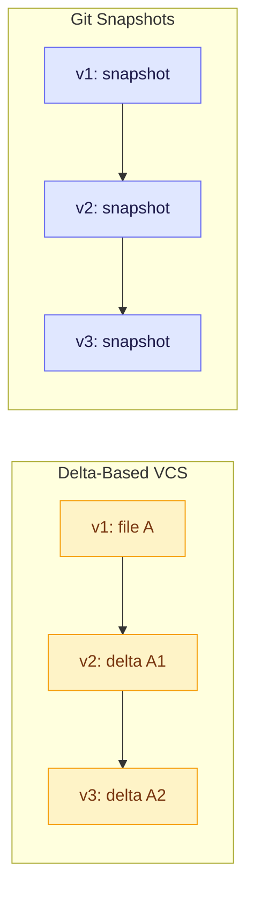
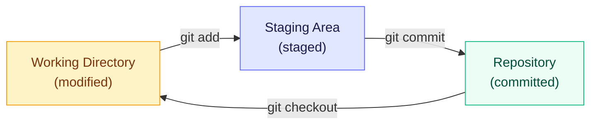
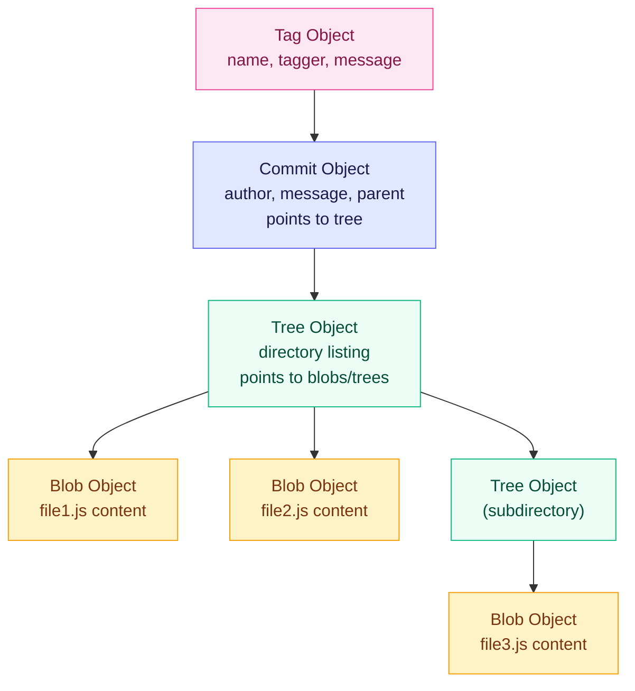
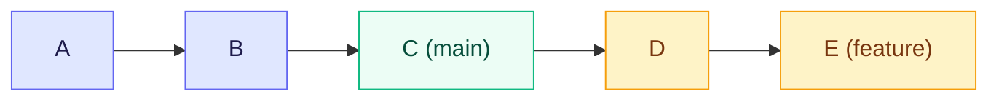
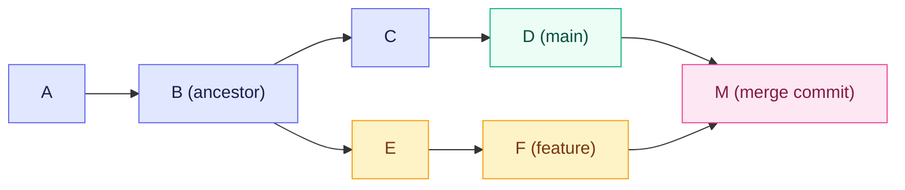
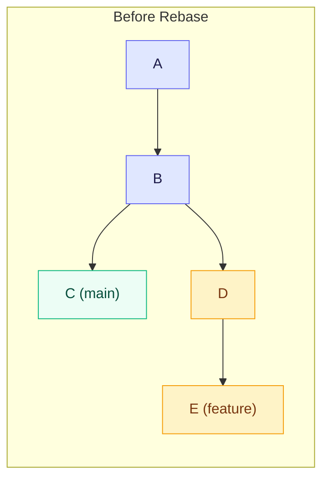
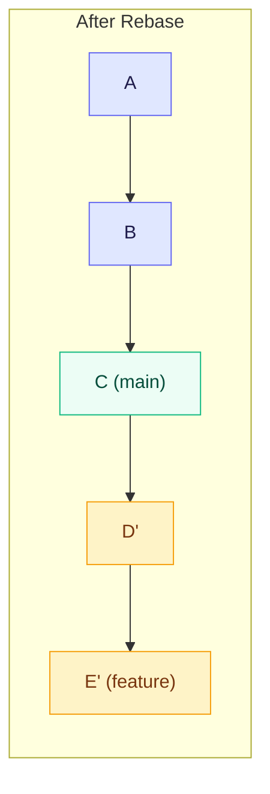
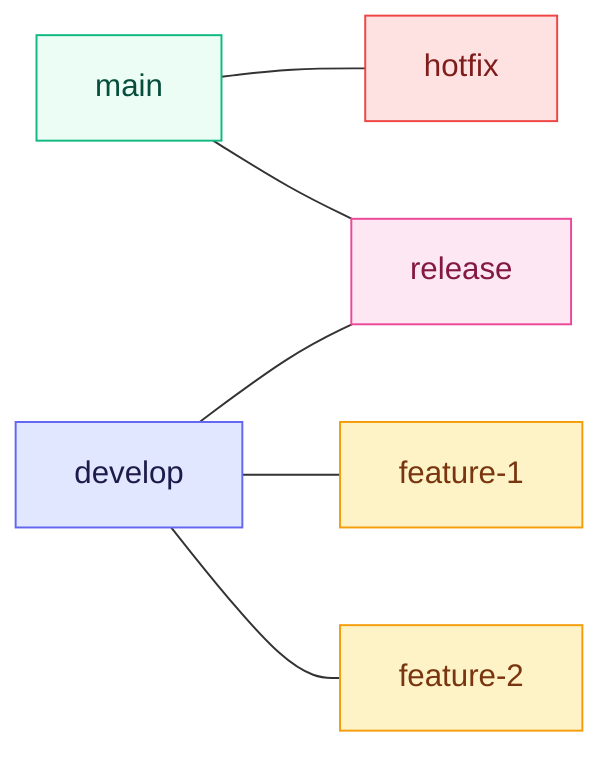
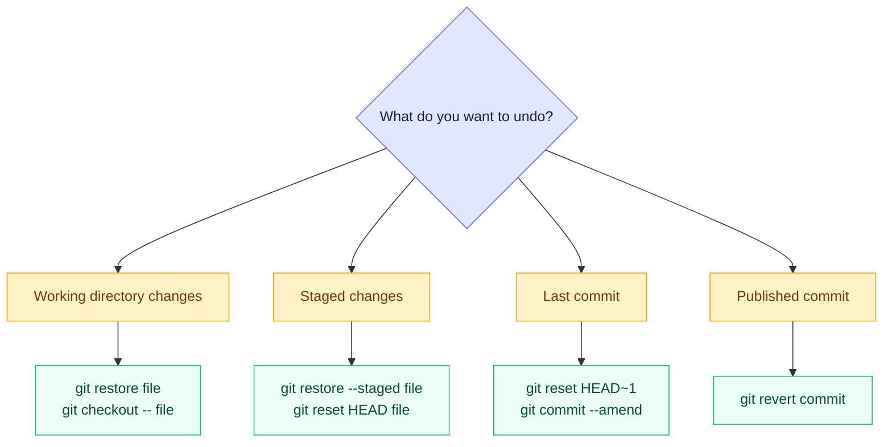
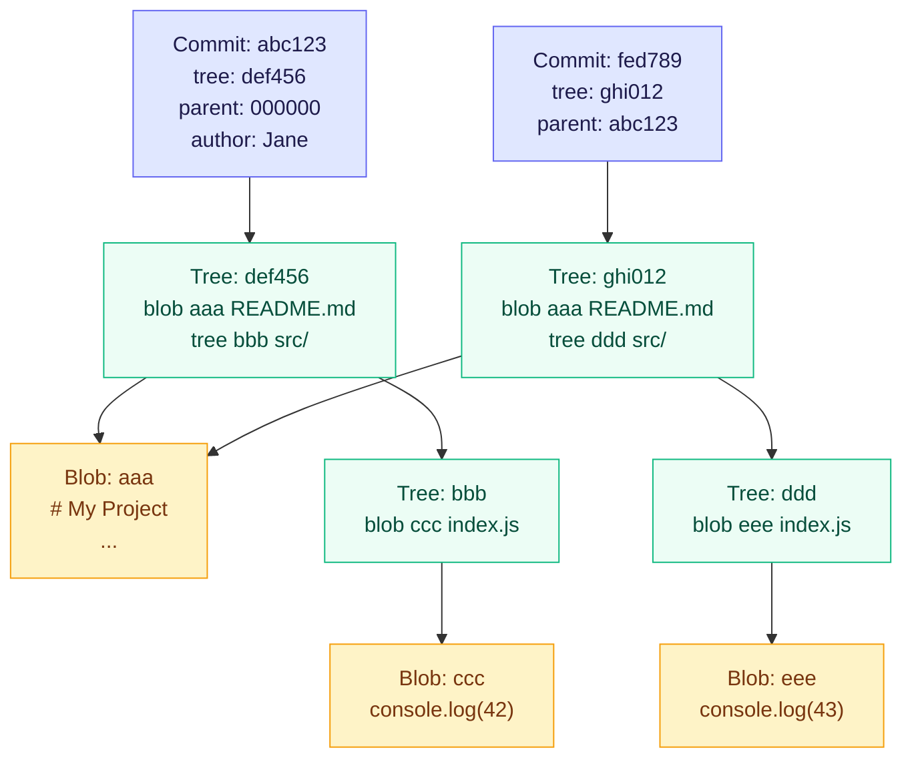

# Git — Complete Guide

## Table of Contents

- [1. What is Git?](#1-what-is-git)
- [2. Git Internals](#2-git-internals)
- [3. Branching & Merging](#3-branching--merging)
- [4. Rebasing](#4-rebasing)
- [5. Git Workflows](#5-git-workflows)
- [6. Undoing Changes](#6-undoing-changes)
- [7. Stashing](#7-stashing)
- [8. Cherry-Pick](#8-cherry-pick)
- [9. Remote Operations](#9-remote-operations)
- [10. Tags](#10-tags)
- [11. Advanced Topics](#11-advanced-topics)
- [12. Best Practices](#12-best-practices)
- [13. Interview Questions & Answers](#13-interview-questions--answers)

---

## 1. What is Git?

Git is a **distributed version control system** (DVCS) created by Linus Torvalds in 2005 for Linux kernel development. Unlike centralized VCS tools (SVN, CVS), every developer has a **full copy** of the repository, including its entire history.

### 1.1 Key Characteristics

- **Distributed**: Every clone is a full repository with complete history
- **Fast**: Nearly all operations are local (no network round-trip)
- **Integrity**: Everything is checksummed with SHA-1 hashes before storage
- **Branching**: Lightweight branches make branching/merging cheap and frequent
- **Staging area**: An intermediate area between working directory and repository

### 1.2 Snapshots, Not Diffs

Most VCS tools store information as a list of file-based changes (deltas). Git instead stores **snapshots** of the entire project at each commit. If a file hasn't changed, Git stores a reference to the previous identical file rather than a copy.



### 1.3 The Three States

Every file in a Git repository exists in one of three states, and Git has three main areas where files reside:



| State | Location | Description |
|-------|----------|-------------|
| **Modified** | Working Directory | File has changed but not staged |
| **Staged** | Staging Area (Index) | Marked a modified file to go into the next commit |
| **Committed** | .git Repository | Data is safely stored in the local database |

The **staging area** (also called the **index**) is a file in `.git/index` that stores information about what will go into your next commit. This is what makes Git unique — you can selectively stage parts of your changes.

```bash
# Check which state files are in
git status

# Stage specific files
git add file1.js file2.js

# Stage parts of a file (interactive)
git add -p file.js

# Commit staged changes
git commit -m "Add feature"
```

### 1.4 Distributed vs Centralized

| Feature | Distributed (Git) | Centralized (SVN) |
|---------|-------------------|-------------------|
| Full history locally | Yes | No |
| Offline work | Full capability | Limited |
| Speed | Very fast (local ops) | Slower (network ops) |
| Branching | Lightweight, fast | Heavy, slow |
| Single point of failure | No | Yes (central server) |
| Backup | Every clone is a backup | Need separate backups |

---

## 2. Git Internals

Understanding Git internals transforms you from a Git user to someone who truly understands what every command does under the hood.

### 2.1 The .git Directory

When you run `git init`, Git creates a `.git` directory with this structure:

```bash
.git/
├── HEAD              # Points to current branch ref
├── config            # Repository-specific configuration
├── description       # Used by GitWeb (rarely used)
├── hooks/            # Client/server-side hook scripts
├── index             # Staging area information
├── info/
│   └── exclude       # Patterns to ignore (local .gitignore)
├── objects/          # All content (blobs, trees, commits, tags)
│   ├── info/
│   └── pack/         # Packed objects for efficiency
└── refs/             # Pointers to commit objects
    ├── heads/        # Branch tips
    ├── tags/         # Tag objects
    └── remotes/      # Remote tracking branches
```

### 2.2 Git Objects

Git is fundamentally a **content-addressable filesystem**. Everything is stored as objects identified by SHA-1 hashes. There are four types of objects:



#### Blob (Binary Large Object)
Stores file contents. A blob is just the contents — no filename, no permissions, nothing else. The same content always produces the same blob hash.

```bash
# Create a blob and see its hash
echo "Hello Git" | git hash-object --stdin -w
# Output: 9f4d96d5b00d98959ea9960f069585ce42b1349a

# Read blob content
git cat-file -p 9f4d96d
```

#### Tree
Represents a directory. A tree object contains pointers to blobs (files) and other trees (subdirectories), along with file modes and names.

```bash
# View a tree object
git cat-file -p main^{tree}
# 100644 blob a906cb2...    README.md
# 040000 tree 99f1a6d...    src
```

#### Commit
Points to a tree (the root snapshot), contains author/committer info, a message, and pointers to parent commits.

```bash
# View a commit object
git cat-file -p HEAD
# tree 8f94139...
# parent 5e2482e...
# author John Doe <john@example.com> 1621234567 +0000
# committer John Doe <john@example.com> 1621234567 +0000
#
# Add login feature
```

#### Tag (Annotated)
Points to a commit (typically) and contains a tagger, date, and message. Lightweight tags are just refs, not objects.

### 2.3 Refs and HEAD

**Refs** are human-readable pointers to commit hashes, stored in `.git/refs/`.

```bash
# A branch is just a file containing a commit hash
cat .git/refs/heads/main
# 5e2482e1a0b2...

# HEAD is a symbolic ref pointing to the current branch
cat .git/HEAD
# ref: refs/heads/main
```

**HEAD** is a special pointer that indicates your current position in the repository:
- **Attached HEAD**: Points to a branch (normal state) — `ref: refs/heads/main`
- **Detached HEAD**: Points directly to a commit — happens when you checkout a specific commit, tag, or remote branch

```bash
# Detached HEAD state
git checkout abc1234
# WARNING: You are in 'detached HEAD' state...

# Relative refs
git log HEAD~3    # 3 commits before HEAD
git log HEAD^     # First parent of HEAD
git log HEAD^2    # Second parent (for merge commits)
git log HEAD~2^2  # Combine: 2 back, then second parent
```

### 2.4 Reflog

The reflog records every time HEAD moves — even operations that don't appear in `git log`. It's your safety net.

```bash
# View reflog
git reflog
# a1b2c3d HEAD@{0}: commit: Add feature
# e4f5g6h HEAD@{1}: checkout: moving from feature to main
# i7j8k9l HEAD@{2}: commit: Fix bug

# Recover a "lost" commit after hard reset
git reset --hard HEAD~3    # Oops, went too far
git reflog                 # Find the commit hash
git reset --hard HEAD@{1}  # Restore to before the reset
```

> **Important**: Reflog entries expire after 90 days (30 days for unreachable commits). It's local only — not shared with remotes.

### 2.5 Packfiles

Git periodically packs loose objects into **packfiles** for efficiency. Instead of storing every version as a complete snapshot, packfiles use delta compression.

```bash
# Manually trigger packing
git gc

# View pack contents
git verify-pack -v .git/objects/pack/pack-*.idx
```

---

## 3. Branching & Merging

Branching is Git's "killer feature". Creating a branch is nearly instantaneous — Git just creates a new 41-byte file (a pointer to a commit).

### 3.1 Creating and Managing Branches

```bash
# Create a branch
git branch feature-login

# Create and switch to a branch
git checkout -b feature-login
# Modern alternative:
git switch -c feature-login

# List branches
git branch          # local
git branch -r       # remote
git branch -a       # all
git branch -v       # with last commit

# Delete a branch
git branch -d feature-login     # safe delete (checks merge status)
git branch -D feature-login     # force delete

# Rename a branch
git branch -m old-name new-name
```

### 3.2 Fast-Forward Merge

When the target branch hasn't diverged from the source branch, Git simply moves the pointer forward. No merge commit is created.



After `git merge feature`:


```bash
git checkout main
git merge feature-login
# Fast-forward (no merge commit)

# Force a merge commit even when fast-forward is possible
git merge --no-ff feature-login
```

### 3.3 Three-Way Merge

When both branches have diverged, Git performs a three-way merge using the common ancestor, creating a new **merge commit** with two parents.



```bash
git checkout main
git merge feature-login
# Creates a merge commit with two parents
```

### 3.4 Merge Conflicts

Conflicts occur when both branches modify the same part of the same file. Git marks the conflicting sections:

```
<<<<<<< HEAD
const port = 3000;
=======
const port = 8080;
>>>>>>> feature-login
```

**Resolving conflicts:**

```bash
# 1. Open conflicted files and edit manually
# 2. Remove conflict markers (<<<<<<<, =======, >>>>>>>)
# 3. Stage the resolved files
git add resolved-file.js

# 4. Complete the merge
git commit

# Or abort the merge entirely
git merge --abort
```

**Useful merge tools:**

```bash
# Use a visual merge tool
git mergetool

# See what changes each side made
git diff --ours     # Changes in current branch
git diff --theirs   # Changes in merging branch
git diff --base     # Changes from common ancestor
```

### 3.5 Merge Strategies

| Strategy | Flag | Use Case |
|----------|------|----------|
| **recursive** (default) | `-s recursive` | Standard two-branch merge |
| **ort** (Git 2.33+) | `-s ort` | Faster replacement for recursive |
| **ours** | `-s ours` | Keep our version entirely, discard theirs |
| **octopus** | `-s octopus` | Merge more than two branches simultaneously |
| **resolve** | `-s resolve` | Simple three-way merge (for two heads only) |

```bash
# Strategy options (sub-strategy tweaks)
git merge -X ours feature    # Auto-resolve conflicts using ours
git merge -X theirs feature  # Auto-resolve conflicts using theirs
git merge -X patience feature # Use patience diff algorithm
```

> **Note**: `-s ours` discards the other branch's changes entirely. `-X ours` only uses "ours" for conflicting hunks and keeps non-conflicting changes from both sides.

---

## 4. Rebasing

Rebasing re-applies your commits on top of another branch, creating a linear history. Instead of a merge commit, it rewrites commit history.

### 4.1 Regular Rebase





```bash
# On feature branch, rebase onto main
git checkout feature
git rebase main

# Resolve any conflicts, then continue
git add resolved-file.js
git rebase --continue

# Or abort the rebase
git rebase --abort

# Skip the current problematic commit
git rebase --skip
```

### 4.2 Interactive Rebase

Interactive rebase lets you edit, squash, reorder, or drop commits before they're applied.

```bash
# Rebase last 4 commits interactively
git rebase -i HEAD~4
```

This opens an editor with:

```
pick a1b2c3d Add user model
pick e4f5g6h Add user controller
pick i7j8k9l Fix typo in user model
pick m0n1o2p Add user routes

# Commands:
# p, pick   = use commit
# r, reword = use commit, but edit the message
# e, edit   = use commit, but stop to amend
# s, squash = use commit, meld into previous
# f, fixup  = like squash, but discard this commit's log message
# d, drop   = remove commit
```

**Common interactive rebase operations:**

```bash
# Squash the typo fix into the model commit
pick a1b2c3d Add user model
fixup i7j8k9l Fix typo in user model
pick e4f5g6h Add user controller
pick m0n1o2p Add user routes

# Reword a commit message
reword a1b2c3d Add user model

# Reorder commits (just move lines)
pick e4f5g6h Add user controller
pick a1b2c3d Add user model
```

### 4.3 Rebase vs Merge

| Aspect | Merge | Rebase |
|--------|-------|--------|
| History | Non-linear (preserves branch topology) | Linear (flat history) |
| Merge commits | Creates merge commits | No merge commits |
| Existing commits | Never changes existing commits | Rewrites commits (new hashes) |
| Conflict resolution | Resolve once | May resolve same conflict per commit |
| Traceability | Shows when branches were integrated | Loses branch integration points |
| Safety | Safe for shared branches | Dangerous for shared branches |
| Best for | Public/shared branches | Local/feature branches before merge |

### 4.4 The Golden Rule of Rebasing

> **Never rebase commits that have been pushed to a public/shared repository.**

Rebasing rewrites commit history (creates new commit hashes). If others have based work on the original commits, rebasing creates duplicate commits and confusion.

```bash
# SAFE: Rebase your local feature branch onto updated main
git checkout feature
git rebase main

# DANGEROUS: Rebase a shared branch
git checkout main
git rebase feature    # DON'T DO THIS if others use main
```

**When it's OK to rebase:**
- Your local feature branch before opening a PR
- Commits you haven't pushed yet
- Your own branch that nobody else is working on

**When to merge instead:**
- Integrating shared/public branches
- When you want to preserve the record of when integration happened
- When working on a shared feature branch with others

### 4.5 Rebase onto

Use `--onto` for more precise control over which commits to replay:

```bash
# Rebase feature branch from old-base onto new-base
# Only take commits that are on feature but not on old-base
git rebase --onto new-base old-base feature

# Example: Move commits from feature that were based on develop onto main
git rebase --onto main develop feature
```

---

## 5. Git Workflows

### 5.1 Git Flow

A structured workflow for projects with scheduled releases.



| Branch | Purpose | Branches from | Merges into |
|--------|---------|---------------|-------------|
| `main` | Production-ready code | — | — |
| `develop` | Integration branch | `main` | `release` |
| `feature/*` | New features | `develop` | `develop` |
| `release/*` | Release prep, bug fixes | `develop` | `main` + `develop` |
| `hotfix/*` | Urgent production fixes | `main` | `main` + `develop` |

**Pros**: Clear structure, parallel development, release management.
**Cons**: Complex, too heavy for continuous delivery, many long-lived branches.

### 5.2 GitHub Flow

A simpler workflow — one main branch, feature branches, and pull requests.

```bash
# 1. Create a branch from main
git checkout -b feature-login main

# 2. Make commits
git add . && git commit -m "Add login form"

# 3. Push and open a Pull Request
git push -u origin feature-login

# 4. Discuss and review via PR

# 5. Deploy from feature branch (or after merge)

# 6. Merge to main
git checkout main && git merge feature-login
```

**Pros**: Simple, great for CI/CD, encourages code review.
**Cons**: No separate release/hotfix branches, assumes main is always deployable.

### 5.3 Trunk-Based Development

All developers commit to a single branch (trunk/main), using short-lived feature branches (< 1-2 days).

```bash
# Short-lived feature branch (1-2 days max)
git checkout -b short-feature main
# ... make changes ...
git checkout main
git merge short-feature
git branch -d short-feature
```

**Key practices:**
- Feature flags to hide incomplete work
- Short-lived branches (hours to 1-2 days)
- Frequent integration (multiple times per day)
- Comprehensive automated testing

**Pros**: Simple, minimal merge conflicts, fast integration.
**Cons**: Requires strong CI/CD, feature flags add complexity, needs mature testing.

### 5.4 Forking Workflow

Used in open-source projects. Each contributor has their own fork (server-side clone).

```bash
# 1. Fork the repository on GitHub

# 2. Clone your fork
git clone https://github.com/you/project.git
cd project

# 3. Add upstream remote
git remote add upstream https://github.com/original/project.git

# 4. Create a feature branch
git checkout -b fix-bug

# 5. Make changes, commit, push to YOUR fork
git push origin fix-bug

# 6. Open a Pull Request from your fork to the original repo

# 7. Keep your fork updated
git fetch upstream
git checkout main
git merge upstream/main
git push origin main
```

### 5.5 Workflow Comparison

| Workflow | Team Size | Release Cadence | Complexity |
|----------|-----------|-----------------|------------|
| Git Flow | Medium-Large | Scheduled releases | High |
| GitHub Flow | Any | Continuous delivery | Low |
| Trunk-Based | Medium-Large | Continuous deployment | Low |
| Forking | Open source | Varies | Medium |

---

## 6. Undoing Changes

One of Git's greatest strengths is the ability to undo almost anything. Understanding the right tool for each situation is essential.

### 6.1 Overview of Undo Commands



### 6.2 git restore (Modern Way)

Introduced in Git 2.23 to replace the overloaded `git checkout` for file operations.

```bash
# Discard changes in working directory
git restore file.js
git restore .                     # All files

# Unstage files (remove from staging area)
git restore --staged file.js
git restore --staged .            # Unstage all

# Restore file from a specific commit
git restore --source=HEAD~3 file.js

# Restore both working directory and staging area
git restore --staged --worktree file.js
```

### 6.3 git reset

Moves the branch pointer (HEAD) to a different commit. Three modes control what happens to the staging area and working directory:

```bash
# Soft: Move HEAD, keep staging area and working directory
git reset --soft HEAD~1
# Staged changes: YES (previous commit's changes become staged)
# Working directory: unchanged

# Mixed (default): Move HEAD, reset staging area, keep working directory
git reset HEAD~1
git reset --mixed HEAD~1    # Same as above
# Staged changes: NO (changes moved to working directory)
# Working directory: unchanged

# Hard: Move HEAD, reset staging area AND working directory
git reset --hard HEAD~1
# Staged changes: NO
# Working directory: RESET (changes are LOST!)
```

| Mode | HEAD | Staging Area | Working Directory |
|------|------|-------------|-------------------|
| `--soft` | Moved | Unchanged | Unchanged |
| `--mixed` | Moved | Reset | Unchanged |
| `--hard` | Moved | Reset | Reset |

**Common use cases:**

```bash
# Undo last commit but keep changes staged
git reset --soft HEAD~1

# Undo last commit and unstage changes
git reset HEAD~1

# Completely discard last 3 commits
git reset --hard HEAD~3

# Unstage a file (same as git restore --staged)
git reset HEAD file.js
```

### 6.4 git revert

Creates a **new commit** that undoes the changes of a previous commit. This is safe for shared/public history because it doesn't rewrite history.

```bash
# Revert a specific commit
git revert abc1234

# Revert without auto-committing (lets you edit or combine)
git revert --no-commit abc1234

# Revert a merge commit (specify which parent to keep)
git revert -m 1 merge-commit-hash
# -m 1 keeps the first parent (usually the main branch)
# -m 2 keeps the second parent (the merged branch)

# Revert a range of commits
git revert HEAD~3..HEAD
```

### 6.5 git commit --amend

Replaces the last commit with a new one. Useful for fixing typos or adding forgotten changes.

```bash
# Change the last commit message
git commit --amend -m "Corrected commit message"

# Add forgotten files to the last commit
git add forgotten-file.js
git commit --amend --no-edit    # Keep the same message

# Change author of last commit
git commit --amend --author="New Author <new@email.com>"
```

> **Warning**: Amending changes the commit hash. Don't amend commits that have been pushed to a shared branch.

### 6.6 git clean

Removes **untracked files** from the working directory.

```bash
# Preview what would be deleted (dry run)
git clean -n

# Remove untracked files
git clean -f

# Remove untracked files AND directories
git clean -fd

# Remove ignored files too
git clean -fX

# Remove both ignored and untracked
git clean -fx
```

### 6.7 Comparison: When to Use What

| Scenario | Command | Rewrites History? |
|----------|---------|-------------------|
| Discard uncommitted file changes | `git restore file` | No |
| Unstage a file | `git restore --staged file` | No |
| Undo last commit, keep changes staged | `git reset --soft HEAD~1` | Yes (local) |
| Undo last commit, keep changes unstaged | `git reset HEAD~1` | Yes (local) |
| Completely discard commits | `git reset --hard HEAD~N` | Yes (local) |
| Undo a published commit safely | `git revert <commit>` | No |
| Fix the last commit message/content | `git commit --amend` | Yes (local) |
| Remove untracked files | `git clean -f` | No |

---

## 7. Stashing

Git stash temporarily shelves changes you've made to your working directory so you can work on something else, then come back and re-apply them later.

### 7.1 Basic Stash Operations

```bash
# Stash current changes (tracked files only)
git stash
# Same as:
git stash push

# Stash with a descriptive message
git stash push -m "WIP: login form validation"

# List all stashes
git stash list
# stash@{0}: On feature: WIP: login form validation
# stash@{1}: WIP on main: abc1234 Fix header

# Apply the most recent stash (keeps it in stash list)
git stash apply

# Apply a specific stash
git stash apply stash@{2}

# Apply and remove from stash list
git stash pop

# Remove a specific stash
git stash drop stash@{1}

# Clear all stashes
git stash clear
```

### 7.2 Advanced Stash Options

```bash
# Include untracked files
git stash push -u
git stash push --include-untracked

# Include untracked AND ignored files
git stash push -a
git stash push --all

# Stash specific files only (partial stash)
git stash push -m "stash only utils" -- src/utils.js src/helpers.js

# Interactive stash (select hunks)
git stash push -p

# View stash contents
git stash show              # Summary
git stash show -p           # Full diff
git stash show stash@{1}    # Specific stash

# Create a branch from a stash
git stash branch new-branch stash@{0}
# Creates branch, checks it out, applies stash, drops it
```

### 7.3 How Stash Works Internally

A stash is actually a special commit object. When you stash, Git creates:
1. A commit for the **working directory** state
2. A commit for the **staging area** (index) state
3. Optionally, a commit for **untracked** files

These are stored in `.git/refs/stash` and the reflog at `.git/logs/refs/stash`.

---

## 8. Cherry-Pick

Cherry-pick applies the changes introduced by a specific commit onto the current branch. It creates a **new commit** with the same changes but a different hash.

### 8.1 Basic Usage

```bash
# Apply a single commit to current branch
git cherry-pick abc1234

# Apply multiple commits
git cherry-pick abc1234 def5678

# Apply a range of commits (exclusive of first, inclusive of last)
git cherry-pick abc1234..ghi9012

# Apply range (inclusive of both)
git cherry-pick abc1234^..ghi9012

# Cherry-pick without committing (stage changes only)
git cherry-pick --no-commit abc1234

# Cherry-pick and edit the commit message
git cherry-pick --edit abc1234
```

### 8.2 Handling Cherry-Pick Conflicts

```bash
# If conflicts occur during cherry-pick:
# 1. Resolve the conflicts manually
# 2. Stage resolved files
git add resolved-file.js

# 3. Continue the cherry-pick
git cherry-pick --continue

# Or abort the cherry-pick
git cherry-pick --abort
```

### 8.3 When to Use Cherry-Pick

| Use Case | Example |
|----------|---------|
| **Backport a fix** | Apply a bug fix from `develop` to `release` |
| **Salvage commits** | Recover specific commits from an abandoned branch |
| **Selective deployment** | Move specific features to a release branch |
| **Hotfix** | Apply an urgent fix to multiple branches |

### 8.4 Risks and Considerations

- **Duplicate commits**: Cherry-picked commits have different hashes, creating duplicates if branches are later merged
- **Context dependency**: A commit may depend on previous changes not present in the target branch
- **Merge confusion**: Repeated cherry-picks between branches can cause merge conflicts later
- **Prefer merge/rebase** when possible — cherry-pick is for exceptions, not the regular workflow

---

## 9. Remote Operations

### 9.1 Remotes Basics

A **remote** is a reference to another copy of the repository, typically on a server.

```bash
# List remotes
git remote -v
# origin  https://github.com/you/repo.git (fetch)
# origin  https://github.com/you/repo.git (push)

# Add a remote
git remote add upstream https://github.com/original/repo.git

# Remove a remote
git remote remove upstream

# Rename a remote
git remote rename origin old-origin

# Show remote details
git remote show origin
```

### 9.2 Fetch vs Pull

```mermaid
graph LR
    R["Remote Repository"] -->|git fetch| LR["Local Remote-Tracking<br/>origin/main"]
    LR -->|git merge| L["Local Branch<br/>main"]
    R -->|git pull<br/>(fetch + merge)| L
    style R fill:#e0e7ff,stroke:#6366f1,color:#1e1b4b
    style LR fill:#fef3c7,stroke:#f59e0b,color:#78350f
    style L fill:#ecfdf5,stroke:#10b981,color:#064e3b
```

```bash
# Fetch: Download commits/branches from remote (doesn't modify working directory)
git fetch origin
git fetch --all           # Fetch from all remotes
git fetch origin main     # Fetch specific branch

# Pull: Fetch + Merge (or Rebase)
git pull                  # Fetch + merge
git pull --rebase         # Fetch + rebase (linear history)
git pull origin main      # Pull specific branch

# Set pull to rebase by default
git config --global pull.rebase true
```

| Operation | Modifies Working Directory? | Modifies Local Branch? | Safe? |
|-----------|---------------------------|----------------------|-------|
| `git fetch` | No | No | Always safe |
| `git pull` (merge) | Yes | Yes | Can cause conflicts |
| `git pull --rebase` | Yes | Yes | Can cause conflicts |

### 9.3 Push

```bash
# Push current branch to remote
git push

# Push and set upstream tracking
git push -u origin feature-branch
git push --set-upstream origin feature-branch

# Push a specific branch
git push origin main

# Push all branches
git push --all

# Push tags
git push --tags
git push origin v1.0.0    # Specific tag

# Delete a remote branch
git push origin --delete feature-branch
git push origin :feature-branch    # Short form
```

### 9.4 Tracking Branches

A **tracking branch** (or **upstream branch**) is a local branch that has a direct relationship with a remote branch.

```bash
# Set upstream for current branch
git branch --set-upstream-to=origin/main
git branch -u origin/main

# Create a tracking branch from remote
git checkout --track origin/feature
# Short form (if no local branch with that name exists):
git checkout feature    # Auto-tracks origin/feature

# See tracking relationships
git branch -vv
# * main     abc1234 [origin/main] Latest commit
#   feature  def5678 [origin/feature: ahead 2] My changes

# Check ahead/behind status
git status
# Your branch is ahead of 'origin/main' by 2 commits
```

### 9.5 Force Push and --force-with-lease

```bash
# Force push (DANGEROUS: overwrites remote history)
git push --force
git push -f

# Safe force push (fails if remote has commits you don't have)
git push --force-with-lease

# Force push with lease on specific branch
git push --force-with-lease origin feature-branch
```

> **Always prefer `--force-with-lease` over `--force`**. Regular `--force` overwrites the remote regardless of what others have pushed. `--force-with-lease` checks that the remote ref matches what you expect, refusing to push if someone else has pushed in the meantime.

**When force push is needed:**
- After rebasing a feature branch
- After amending commits
- After squashing commits
- After `git reset` on a pushed branch

### 9.6 Diverged History

When your local branch and the remote branch have both moved forward, you have **diverged history**.

```bash
# Scenario: You and a coworker both pushed to the same branch
git push
# ! [rejected] main -> main (fetch first)

# Option 1: Merge (creates merge commit)
git pull              # fetch + merge
git push

# Option 2: Rebase (linear history)
git pull --rebase     # fetch + rebase
git push

# Option 3: Fetch and inspect first
git fetch origin
git log --oneline HEAD..origin/main   # See what's new on remote
git log --oneline origin/main..HEAD   # See what you have locally
git merge origin/main                 # Then merge
```

### 9.7 Push and Pull Arguments

```bash
# Full syntax
git push <remote> <local-branch>:<remote-branch>
git pull <remote> <remote-branch>

# Push local "feature" branch as "my-feature" on remote
git push origin feature:my-feature

# Fetch remote "develop" into local "my-develop"
git fetch origin develop:my-develop

# Delete remote branch (push "nothing" to it)
git push origin :old-branch

# Pull from a specific remote branch into current branch
git pull origin develop
```

---

## 10. Tags

Tags mark specific points in history as important — typically used for release versions.

### 10.1 Lightweight vs Annotated Tags

```bash
# Lightweight tag: just a pointer to a commit (like a branch that doesn't move)
git tag v1.0.0
git tag v1.0.0 abc1234      # Tag a specific commit

# Annotated tag: full object with tagger name, email, date, message
git tag -a v1.0.0 -m "Release version 1.0.0"
git tag -a v1.0.0 abc1234 -m "Release version 1.0.0"  # Tag specific commit
```

| Feature | Lightweight | Annotated |
|---------|------------|-----------|
| Stored as | Ref only (pointer to commit) | Full Git object |
| Metadata | None | Tagger, date, message |
| GPG signing | No | Yes (`git tag -s`) |
| Best for | Temporary/private markers | Releases, public tags |
| Shown in `git describe` | No (by default) | Yes |

### 10.2 Managing Tags

```bash
# List tags
git tag
git tag -l "v1.*"           # Filter with pattern

# Show tag details
git show v1.0.0

# Delete a local tag
git tag -d v1.0.0

# Delete a remote tag
git push origin --delete v1.0.0
git push origin :refs/tags/v1.0.0

# Push tags to remote
git push origin v1.0.0      # Single tag
git push --tags              # All tags
git push --follow-tags       # Only annotated tags

# Checkout a tag (detached HEAD)
git checkout v1.0.0

# Create a branch from a tag
git checkout -b hotfix-v1 v1.0.0
```

### 10.3 Semantic Versioning (SemVer)

Tags commonly follow **Semantic Versioning** — `vMAJOR.MINOR.PATCH`:

| Component | When to Increment | Example |
|-----------|-------------------|---------|
| **MAJOR** | Breaking/incompatible API changes | `v1.0.0` -> `v2.0.0` |
| **MINOR** | Backward-compatible new features | `v1.0.0` -> `v1.1.0` |
| **PATCH** | Backward-compatible bug fixes | `v1.0.0` -> `v1.0.1` |

Pre-release suffixes: `v1.0.0-alpha`, `v1.0.0-beta.1`, `v1.0.0-rc.1`

---

## 11. Advanced Topics

### 11.1 Git Bisect

Binary search through commits to find which commit introduced a bug.

```bash
# Start bisecting
git bisect start

# Mark current commit as bad (has the bug)
git bisect bad

# Mark a known good commit (before the bug)
git bisect good v1.0.0

# Git checkouts a middle commit — test it, then mark:
git bisect good    # if this commit doesn't have the bug
git bisect bad     # if this commit has the bug

# Repeat until Git identifies the exact commit

# End bisecting (return to original branch)
git bisect reset

# Automated bisect with a test script
git bisect start HEAD v1.0.0
git bisect run npm test
# Git automatically finds the first commit where tests fail
```

### 11.2 Submodules

Include one Git repository inside another as a subdirectory.

```bash
# Add a submodule
git submodule add https://github.com/lib/utils.git libs/utils

# Clone a repo with submodules
git clone --recurse-submodules https://github.com/you/project.git

# Initialize submodules after clone (if you forgot --recurse)
git submodule init
git submodule update
# Or combined:
git submodule update --init --recursive

# Update submodule to latest remote commit
cd libs/utils
git pull origin main
cd ../..
git add libs/utils
git commit -m "Update utils submodule"

# Update all submodules
git submodule update --remote
```

**Submodule gotchas:**
- Submodules point to a specific commit, not a branch
- Team members must run `git submodule update` after pulling
- Moving/removing submodules requires updating `.gitmodules` and `.git/config`

### 11.3 Subtrees

An alternative to submodules — merges another repo's content directly into a subdirectory.

```bash
# Add a subtree
git subtree add --prefix=libs/utils https://github.com/lib/utils.git main --squash

# Pull updates from the subtree remote
git subtree pull --prefix=libs/utils https://github.com/lib/utils.git main --squash

# Push changes back to the subtree remote
git subtree push --prefix=libs/utils https://github.com/lib/utils.git main
```

| Feature | Submodules | Subtrees |
|---------|-----------|----------|
| External repo as | Separate repo (linked) | Merged into parent |
| Requires special commands | Yes (submodule init/update) | No (works with clone) |
| History | Separate | Mixed with parent |
| Contributing back | Easy (it's a normal repo) | Possible with subtree push |
| Complexity | Higher for team | Lower for team |

### 11.4 Worktrees

Checkout multiple branches simultaneously in separate directories — without cloning the repo again.

```bash
# Create a worktree for a branch
git worktree add ../hotfix-branch hotfix/urgent-fix

# Create a new branch in a worktree
git worktree add -b new-feature ../new-feature-dir

# List worktrees
git worktree list

# Remove a worktree
git worktree remove ../hotfix-branch

# Prune stale worktree entries
git worktree prune
```

**Use cases**: Working on a hotfix while your main worktree has uncommitted feature work; running tests on one branch while developing on another.

### 11.5 Git Hooks

Scripts that run automatically at certain points in the Git workflow. Stored in `.git/hooks/`.

**Client-side hooks:**

| Hook | Trigger | Common Use |
|------|---------|------------|
| `pre-commit` | Before commit is created | Lint, format, run tests |
| `prepare-commit-msg` | After default message, before editor | Template commit messages |
| `commit-msg` | After message is entered | Validate commit message format |
| `pre-push` | Before push to remote | Run full test suite |
| `post-checkout` | After `git checkout` | Update dependencies |
| `pre-rebase` | Before rebase starts | Prevent rebasing certain branches |

**Server-side hooks:**

| Hook | Trigger | Common Use |
|------|---------|------------|
| `pre-receive` | Before accepting a push | Enforce policies |
| `update` | Per branch, before update | Branch-specific rules |
| `post-receive` | After push is accepted | Deploy, notify, CI trigger |

```bash
# Example pre-commit hook (.git/hooks/pre-commit)
#!/bin/sh
npm run lint
if [ $? -ne 0 ]; then
  echo "Lint failed. Fix errors before committing."
  exit 1
fi
```

> **Tip**: Use tools like **Husky** (Node.js) or **pre-commit** (Python) to manage hooks in a team-friendly way, since `.git/hooks/` is not tracked by Git.

### 11.6 Sparse Checkout

Clone a repository but only checkout specific directories — useful for monorepos.

```bash
# Enable sparse checkout
git clone --filter=blob:none --sparse https://github.com/big/monorepo.git
cd monorepo

# Specify which directories to checkout
git sparse-checkout set packages/my-app packages/shared

# Add more directories
git sparse-checkout add packages/another-app

# List sparse checkout patterns
git sparse-checkout list

# Disable sparse checkout (checkout everything)
git sparse-checkout disable
```

### 11.7 Shallow Clone

Clone with limited history to save time and disk space.

```bash
# Clone with only the last commit
git clone --depth 1 https://github.com/big/repo.git

# Clone with last N commits
git clone --depth 50 https://github.com/big/repo.git

# Fetch more history later (deepen)
git fetch --deepen=100

# Convert shallow clone to full clone
git fetch --unshallow

# Shallow clone a single branch
git clone --depth 1 --single-branch --branch main https://github.com/big/repo.git
```

### 11.8 Git Blame

Show what revision and author last modified each line of a file.

```bash
# Blame a file
git blame src/index.js

# Blame specific lines
git blame -L 10,20 src/index.js

# Ignore whitespace changes
git blame -w src/index.js

# Show commit that moved/copied lines from other files
git blame -C src/index.js

# Show the original author (ignoring a formatting commit)
git blame --ignore-rev abc1234 src/index.js

# Ignore revs from a file (useful for bulk formatting commits)
echo "abc1234" >> .git-blame-ignore-revs
git config blame.ignoreRevsFile .git-blame-ignore-revs
```

### 11.9 Advanced Git Log

```bash
# Graph view
git log --oneline --graph --all --decorate

# Filter by author
git log --author="John"

# Filter by date
git log --after="2024-01-01" --before="2024-06-30"

# Filter by message
git log --grep="fix"

# Filter by file changes
git log -- src/index.js

# Filter by content changes (pickaxe)
git log -S "functionName"          # Find when string was added/removed
git log -G "regex.*pattern"        # Regex version

# Show stats
git log --stat                     # Files changed, insertions/deletions
git log --shortstat                # Summary only

# Custom format
git log --pretty=format:"%h %an %ar %s"

# Find merge commits
git log --merges

# Find non-merge commits
git log --no-merges

# Show diff between two branches
git log main..feature              # Commits in feature but not in main
git log main...feature             # Commits in either but not both
```

### 11.10 Git Diff Advanced

```bash
# Diff between branches
git diff main..feature
git diff main...feature           # Changes since branches diverged

# Diff between commits
git diff abc1234 def5678

# Word-level diff (instead of line-level)
git diff --word-diff

# Show only file names that changed
git diff --name-only
git diff --name-status            # With status (M/A/D)

# Diff with statistics
git diff --stat

# Ignore whitespace
git diff -w
git diff --ignore-all-space
```

---

## 12. Best Practices

### 12.1 Commit Messages

Write clear, consistent commit messages. The widely adopted **Conventional Commits** format:

```
<type>[optional scope]: <description>

[optional body]

[optional footer(s)]
```

**Types:**

| Type | Description |
|------|-------------|
| `feat` | A new feature |
| `fix` | A bug fix |
| `docs` | Documentation changes |
| `style` | Code style (formatting, semicolons) |
| `refactor` | Code change that neither fixes a bug nor adds a feature |
| `perf` | Performance improvement |
| `test` | Adding or updating tests |
| `chore` | Build process, auxiliary tools, dependencies |
| `ci` | CI/CD configuration changes |
| `revert` | Revert a previous commit |

**Examples:**

```bash
# Good commit messages
git commit -m "feat(auth): add JWT token refresh endpoint"
git commit -m "fix(cart): prevent duplicate items on rapid click"
git commit -m "refactor: extract validation logic into shared utils"
git commit -m "docs: update API endpoint documentation"

# Bad commit messages
git commit -m "fix stuff"
git commit -m "WIP"
git commit -m "asdf"
git commit -m "changes"
```

**The 7 rules of a great commit message:**
1. Separate subject from body with a blank line
2. Limit the subject line to 50 characters
3. Capitalize the subject line
4. Do not end the subject line with a period
5. Use the imperative mood ("Add feature" not "Added feature")
6. Wrap the body at 72 characters
7. Use the body to explain *what* and *why*, not *how*

### 12.2 .gitignore

```bash
# Common .gitignore patterns
node_modules/
dist/
build/
.env
.env.local
*.log
.DS_Store
Thumbs.db
.idea/
.vscode/
*.swp
*.swo
coverage/
.cache/
```

```bash
# Useful .gitignore commands
# Check if a file is ignored and why
git check-ignore -v file.log

# Global gitignore (for personal IDE files etc.)
git config --global core.excludesfile ~/.gitignore_global

# Stop tracking a file that's already tracked (but keep locally)
git rm --cached file.env
echo "file.env" >> .gitignore
git commit -m "chore: stop tracking env file"
```

### 12.3 Branch Naming Conventions

```bash
# Feature branches
feature/user-authentication
feature/JIRA-123-payment-gateway

# Bug fix branches
bugfix/login-redirect-loop
fix/null-pointer-cart

# Hotfix branches
hotfix/security-patch-xss
hotfix/v2.1.1

# Release branches
release/v2.0.0
release/2024-q1

# Other conventions
chore/update-dependencies
docs/api-documentation
test/unit-test-coverage
refactor/database-queries
```

### 12.4 Pull Request Best Practices

1. **Keep PRs small** — ideally under 400 lines changed
2. **One concern per PR** — don't mix features and refactoring
3. **Write a clear description** — what, why, how to test
4. **Self-review first** — review your own diff before requesting review
5. **Include tests** — especially for bug fixes
6. **Reference issues** — link to related tickets/issues
7. **Add screenshots** — for UI changes
8. **Respond to feedback** — address all comments before merging
9. **Keep up to date** — rebase/merge main regularly to avoid large conflicts
10. **Use draft PRs** — for work-in-progress that needs early feedback

### 12.5 Keeping History Clean

```bash
# Squash commits before merging (interactive rebase)
git rebase -i main
# Change 'pick' to 'squash' or 'fixup' for cleanup commits

# Squash merge (combine all branch commits into one)
git merge --squash feature-branch
git commit -m "feat: add complete user authentication"

# Autosquash: automatically reorder fixup/squash commits
git commit --fixup=abc1234     # Creates "fixup! Original message"
git rebase -i --autosquash main

# Clean up remote tracking branches that no longer exist
git fetch --prune
git remote prune origin

# Delete merged local branches
git branch --merged main | grep -v "main" | xargs git branch -d
```

### 12.6 Git Aliases

```bash
# Set up useful aliases
git config --global alias.co checkout
git config --global alias.br branch
git config --global alias.ci commit
git config --global alias.st status
git config --global alias.lg "log --oneline --graph --all --decorate"
git config --global alias.last "log -1 HEAD"
git config --global alias.unstage "reset HEAD --"
git config --global alias.undo "reset --soft HEAD~1"
git config --global alias.amend "commit --amend --no-edit"
```

---

## 13. Interview Questions & Answers

### Beginner

---

**Q1: What is the difference between git merge and git rebase?**

Both integrate changes from one branch into another, but they do it differently:

**Merge** creates a new "merge commit" that ties together the histories of both branches. It preserves the complete history and branch topology.

**Rebase** moves your branch's commits to the tip of the target branch, creating new commits with different hashes. It produces a linear history.

```bash
# Merge: creates a merge commit
git checkout main
git merge feature
# History: A - B - C - M (merge commit)
#               \     /
#                D - E

# Rebase: replays commits
git checkout feature
git rebase main
# History: A - B - C - D' - E' (linear)
```

Key difference: Merge preserves history as it happened. Rebase rewrites history to look cleaner. Use merge for shared branches, rebase for local cleanup.

---

**Q2: What is a detached HEAD state and how do you fix it?**

**Detached HEAD** occurs when HEAD points directly to a commit instead of a branch reference. This happens when you checkout a specific commit, a tag, or a remote branch.

```bash
# Enter detached HEAD
git checkout abc1234
# Warning: You are in 'detached HEAD' state...

# Any commits you make are "orphaned" — not on any branch
git commit -m "This commit will be lost if you switch branches"
```

**How to fix it:**

```bash
# Option 1: Create a branch to save your work
git checkout -b new-branch-name

# Option 2: Return to an existing branch (losing detached commits)
git checkout main

# Option 3: If you already switched away, recover via reflog
git reflog
git checkout -b recovery-branch abc1234
```

---

**Q3: What is the staging area (index) and why does Git have it?**

The staging area is an intermediate zone between your working directory and the repository. It lets you control exactly what goes into each commit.

**Why it exists:**
- **Selective commits**: Stage only some changed files, not all
- **Partial staging**: Stage specific lines within a file (`git add -p`)
- **Review before commit**: Verify what's going into the commit
- **Atomic commits**: Build a commit piece by piece

```bash
# Stage specific files
git add src/auth.js src/login.js

# Stage specific hunks (parts of a file)
git add -p src/utils.js

# View what's staged vs unstaged
git diff --staged    # What will be committed
git diff             # What won't be committed (unstaged)
```

Without the staging area, every commit would include all changes — you'd lose the ability to craft clean, focused commits.

---

**Q4: How do you undo the last commit without losing changes?**

Use `git reset` with `--soft` or `--mixed` (the default):

```bash
# Undo commit, keep changes staged (ready to commit again)
git reset --soft HEAD~1

# Undo commit, unstage changes (back to modified state)
git reset HEAD~1            # --mixed is the default

# Undo commit AND discard all changes (DANGEROUS)
git reset --hard HEAD~1
```

If the commit has already been pushed to a shared remote, use `git revert` instead to avoid rewriting public history:

```bash
git revert HEAD
# Creates a new commit that undoes the last commit
```

---

**Q5: What is the difference between `git fetch` and `git pull`?**

`git fetch` downloads new data from the remote repository but does **not** modify your working directory or current branch. It updates your remote-tracking branches (e.g., `origin/main`).

`git pull` is essentially `git fetch` followed by `git merge` (or `git rebase` if configured).

```bash
# Fetch: safe, just downloads
git fetch origin
# Now origin/main is updated, but your local main is unchanged
# You can inspect: git log main..origin/main

# Pull: downloads AND integrates
git pull origin main
# Your local main now includes the remote changes

# Pull with rebase (avoids merge commits)
git pull --rebase origin main
```

**Best practice**: Use `git fetch` first to see what's changed, then decide whether to merge or rebase. This gives you more control.

---

**Q6: What does `git stash` do and when would you use it?**

`git stash` temporarily saves your uncommitted changes (both staged and unstaged) and reverts your working directory to a clean state.

**Common use cases:**
- Need to switch branches but have uncommitted work
- Need to pull remote changes but have local modifications
- Want to temporarily set aside experimental changes

```bash
# Save current changes
git stash push -m "WIP: login feature"

# Switch branches, do other work
git checkout hotfix-branch
# ... fix, commit, push ...

# Return and restore changes
git checkout feature-branch
git stash pop
```

Key commands: `git stash push` (save), `git stash pop` (restore and remove), `git stash apply` (restore and keep), `git stash list` (show all stashes), `git stash drop` (delete a stash).

---

**Q7: How do you resolve a merge conflict?**

A merge conflict occurs when two branches modify the same lines in the same file. Git marks the conflicts in the file:

```
<<<<<<< HEAD (current branch)
const apiUrl = "https://api.prod.example.com";
=======
const apiUrl = "https://api.staging.example.com";
>>>>>>> feature-branch (incoming branch)
```

**Steps to resolve:**

1. Open the conflicted file
2. Choose which version to keep (or combine both)
3. Remove the conflict markers (`<<<<<<<`, `=======`, `>>>>>>>`)
4. Stage the resolved file: `git add file.js`
5. Complete the merge: `git commit`

```bash
# Useful commands during conflict resolution
git status                    # Shows conflicted files
git diff                      # Shows conflict details
git merge --abort             # Abort and go back to before merge
git checkout --ours file.js   # Take current branch version
git checkout --theirs file.js # Take incoming branch version
```

---

**Q8: What is `.gitignore` and how does it work?**

`.gitignore` tells Git which files and directories to ignore (not track). Ignored files won't appear in `git status` and won't be staged by `git add .`.

```bash
# Common patterns
node_modules/          # Directory
*.log                  # All .log files
!important.log         # Exception: DO track this file
build/                 # Build output
.env                   # Environment secrets
**/*.tmp               # .tmp files in any subdirectory
doc/*.pdf              # PDFs only in doc/ (not subdirectories)
```

**Important notes:**
- `.gitignore` only affects **untracked** files. If a file is already tracked, adding it to `.gitignore` won't stop tracking it
- To stop tracking a previously tracked file: `git rm --cached file.env`
- You can have `.gitignore` files in subdirectories (they apply to that directory and below)
- Global gitignore: `git config --global core.excludesfile ~/.gitignore_global`

---

### Intermediate

---

**Q9: Explain the difference between `git reset --soft`, `--mixed`, and `--hard`.**

All three move the HEAD pointer, but they differ in what they do with the staging area and working directory:

| Mode | HEAD | Staging Area | Working Directory | Use Case |
|------|------|-------------|-------------------|----------|
| `--soft` | Moved | Unchanged | Unchanged | Re-commit with different message, combine commits |
| `--mixed` (default) | Moved | Reset to match commit | Unchanged | Unstage changes, rearrange commits |
| `--hard` | Moved | Reset | Reset | Completely discard commits and changes |

```bash
# Starting state: 3 commits ahead
# A - B - C - D (HEAD)

git reset --soft HEAD~2    # HEAD -> B, C+D changes are staged
git reset --mixed HEAD~2   # HEAD -> B, C+D changes are in working dir (unstaged)
git reset --hard HEAD~2    # HEAD -> B, C+D changes are GONE

# Recovery from --hard: use reflog
git reflog
git reset --hard HEAD@{1}
```

---

**Q10: What is `git rebase -i` (interactive rebase) and what can you do with it?**

Interactive rebase lets you modify a series of commits before they're applied. You can reorder, edit, squash, split, or drop commits.

```bash
git rebase -i HEAD~5    # Modify the last 5 commits
```

**Available commands:**

| Command | Short | Effect |
|---------|-------|--------|
| `pick` | `p` | Use the commit as-is |
| `reword` | `r` | Use commit but edit the message |
| `edit` | `e` | Pause to amend the commit |
| `squash` | `s` | Merge into previous commit (combine messages) |
| `fixup` | `f` | Merge into previous commit (discard this message) |
| `drop` | `d` | Remove the commit entirely |

**Common uses:**

```bash
# Squash WIP commits into one clean commit
pick a1b2c3d Add user model
fixup e4f5g6h WIP
fixup i7j8k9l fix typo
pick m0n1o2p Add user routes

# Auto-fixup workflow
git commit --fixup=a1b2c3d    # Creates "fixup! Add user model"
git rebase -i --autosquash HEAD~5
```

---

**Q11: What is `git cherry-pick` and when would you use it?**

Cherry-pick copies a specific commit from one branch and applies it to your current branch, creating a new commit with the same changes but a different hash.

```bash
# Copy commit abc1234 to current branch
git cherry-pick abc1234

# Copy without committing (just stage the changes)
git cherry-pick --no-commit abc1234

# Cherry-pick multiple commits
git cherry-pick abc1234 def5678 ghi9012
```

**When to use:**
- **Backporting bug fixes** from a development branch to a release/maintenance branch
- **Salvaging commits** from an abandoned or deleted branch
- **Applying a hotfix** to multiple release branches

**When NOT to use:**
- As a regular workflow (use merge/rebase instead)
- Cherry-picking between branches that will later be merged (creates duplicates)

---

**Q12: How does `git bisect` work?**

`git bisect` performs a binary search through your commit history to find which commit introduced a bug. It's incredibly efficient — for 1000 commits, it finds the culprit in about 10 steps.

```bash
git bisect start
git bisect bad                # Current commit has the bug
git bisect good v1.0.0        # This version was working

# Git checks out a middle commit. Test it, then:
git bisect good    # Bug not present -> search later commits
git bisect bad     # Bug present -> search earlier commits
# Repeat until found

git bisect reset   # Return to original state
```

**Automated bisect:**

```bash
# Run a script to test each commit automatically
git bisect start HEAD v1.0.0
git bisect run npm test
# Git automatically finds the first failing commit
```

---

**Q13: What is `--force-with-lease` and why is it preferred over `--force`?**

Both `--force` and `--force-with-lease` overwrite the remote branch, but they differ in safety:

- `git push --force` overwrites the remote **unconditionally**, potentially destroying other people's commits
- `git push --force-with-lease` checks that the remote branch is where you expect it to be. If someone else pushed commits, it **refuses** to push

```bash
# Scenario: You rebased your feature branch
git rebase main
git push --force-with-lease origin feature

# If a teammate pushed to your feature branch in the meantime:
# --force would overwrite their commits (BAD)
# --force-with-lease would fail with an error (SAFE)
```

**When you need force push:**
- After rebasing a branch
- After squashing commits
- After amending pushed commits
- After `git reset` on a pushed branch

Always use `--force-with-lease` unless you have a specific reason not to.

---

**Q14: Explain remote-tracking branches. What is `origin/main`?**

A **remote-tracking branch** is a local reference that represents the state of a branch on a remote repository. It's read-only — you can't commit to it directly.

```bash
# Format: <remote>/<branch>
origin/main        # State of 'main' on the 'origin' remote
origin/feature     # State of 'feature' on the 'origin' remote
upstream/develop   # State of 'develop' on the 'upstream' remote
```

**How they update:**

```bash
# Remote-tracking branches update when you fetch/pull
git fetch origin           # Updates all origin/* branches
git fetch origin main      # Updates only origin/main

# They do NOT update when someone pushes to the remote
# You must explicitly fetch to see remote changes
```

**Tracking relationships:**

```bash
# Set a local branch to track a remote branch
git branch -u origin/main

# See tracking info
git branch -vv
# * main   abc1234 [origin/main: ahead 2, behind 1] Latest commit

# "ahead 2" = you have 2 commits not on remote
# "behind 1" = remote has 1 commit you don't have
```

---

**Q15: What is the difference between `git revert` and `git reset`? When would you use each?**

| Aspect | `git reset` | `git revert` |
|--------|------------|-------------|
| **What it does** | Moves branch pointer backward | Creates a new commit that undoes changes |
| **History** | Rewrites history (removes commits) | Preserves history (adds new commit) |
| **Safe for shared branches** | No | Yes |
| **Can undo multiple commits** | Yes (move pointer back N) | Yes (revert each or a range) |
| **Result** | Commits disappear from history | New "undo" commit appears |

```bash
# Reset: Remove last 3 commits (rewrites history)
git reset --hard HEAD~3
# Use when: commits are LOCAL only, not pushed

# Revert: Undo a specific commit (preserves history)
git revert abc1234
# Use when: commit is already PUSHED/shared

# Revert a merge commit
git revert -m 1 merge-commit-hash
```

**Rule of thumb**: Use `reset` for local cleanup, `revert` for public/shared branches.

---

**Q16: How do you squash commits? What are the different ways?**

**Method 1: Interactive rebase**

```bash
git rebase -i HEAD~4
# Change 'pick' to 'squash' or 'fixup' for commits to squash
pick a1b2c3d Add user model
squash e4f5g6h Add validation
fixup i7j8k9l Fix typo
pick m0n1o2p Add routes
# Result: First two commits squashed (combined messages),
#         third folded in (message discarded)
```

**Method 2: Squash merge**

```bash
git checkout main
git merge --squash feature-branch
git commit -m "feat: add complete user authentication"
# All feature branch commits become one commit on main
```

**Method 3: Soft reset**

```bash
git reset --soft HEAD~4
git commit -m "feat: combined commit message"
# All changes from last 4 commits become one new commit
```

| Method | Preserves branch? | Modifies history? | Best for |
|--------|-------------------|-------------------|----------|
| Interactive rebase | Yes | Yes | Cleaning up before PR |
| Squash merge | Yes (feature branch intact) | No (new commit on target) | Merging feature to main |
| Soft reset | No (branch moved) | Yes | Quick local squash |

---

**Q17: What are Git hooks and how are they used?**

Git hooks are scripts that Git executes automatically before or after events such as commit, push, and receive.

**Client-side hooks (in `.git/hooks/`):**

```bash
# pre-commit: Runs before commit is created
#!/bin/sh
npm run lint && npm test
# Exit code 0 = proceed, non-zero = abort commit

# commit-msg: Validate commit message format
#!/bin/sh
commit_msg=$(cat "$1")
if ! echo "$commit_msg" | grep -qE "^(feat|fix|docs|style|refactor|test|chore):"; then
  echo "Error: Commit message must follow Conventional Commits format"
  exit 1
fi

# pre-push: Runs before push
#!/bin/sh
npm run test:ci
```

**Team usage with Husky (Node.js projects):**

```bash
npm install husky --save-dev
npx husky init
# Creates .husky/ directory (tracked in Git)

# Add a pre-commit hook
echo "npm run lint" > .husky/pre-commit
```

Hooks are not copied when cloning — they live in `.git/hooks/` which is not tracked. Tools like Husky solve this by storing hook definitions in the project.

---

**Q18: Explain the forking workflow. How does it differ from branching?**

In the **branching workflow**, developers create branches within a single shared repository. Everyone has push access to the same remote.

In the **forking workflow**, each developer has their own server-side copy (fork) of the repository. They push to their fork and submit pull requests to the original.

```bash
# Forking workflow steps:
# 1. Fork the repo (on GitHub/GitLab)

# 2. Clone YOUR fork
git clone https://github.com/you/project.git

# 3. Add the original repo as "upstream"
git remote add upstream https://github.com/original/project.git

# 4. Create a feature branch (on your fork)
git checkout -b fix-bug

# 5. Push to YOUR fork
git push origin fix-bug

# 6. Open a PR from your fork to the original repo

# 7. Sync your fork with upstream
git fetch upstream
git checkout main
git merge upstream/main
git push origin main
```

| Aspect | Branching | Forking |
|--------|-----------|---------|
| Push access needed | Yes (to shared repo) | No (push to your fork) |
| Isolation | Branches in same repo | Separate repositories |
| Best for | Teams with trust/access | Open source, external contributors |
| Maintenance | Simpler | Must sync fork with upstream |

---

### Advanced

---

**Q19: Explain Git's object model in detail. How does Git store data internally?**

Git is a content-addressable filesystem. All data is stored as four types of objects, identified by SHA-1 hashes:

**1. Blob** — Stores file contents (no filename, no metadata). Same content always produces the same hash.

**2. Tree** — Represents a directory. Contains entries that point to blobs (files) or other trees (subdirectories) along with file modes and names.

**3. Commit** — Points to a tree (root snapshot), contains parent pointer(s), author, committer, and message.

**4. Tag** (annotated) — Points to any object (usually a commit), contains tagger, date, and message.



Notice that blob `aaa` (README.md) is shared between both commits because the content didn't change. Git deduplicates automatically.

**Inspecting objects:**

```bash
# Find the type and content of any object
git cat-file -t abc1234    # Type: commit, tree, blob, or tag
git cat-file -p abc1234    # Pretty-print the content
git cat-file -s abc1234    # Size in bytes

# Hash a file without storing it
echo "Hello" | git hash-object --stdin
# Produces: ce013625030ba8dba906f756967f9e9ca394464a
```

---

**Q20: What happens during a `git merge` under the hood? Explain the three-way merge algorithm.**

A three-way merge uses three reference points:

1. **Base** (common ancestor) — the commit where the two branches diverged
2. **Ours** — the tip of the current branch
3. **Theirs** — the tip of the branch being merged

**The algorithm:**
For each file and each hunk within a file, Git compares all three versions:

| Base | Ours | Theirs | Result |
|------|------|--------|--------|
| A | A | A | A (no change) |
| A | B | A | B (only ours changed) |
| A | A | B | B (only theirs changed) |
| A | B | B | B (both changed to same thing) |
| A | B | C | **CONFLICT** (both changed differently) |

**Steps Git performs internally:**

1. Find the merge base: `git merge-base main feature`
2. Generate diffs: base-to-ours and base-to-theirs
3. Apply non-conflicting changes from both sides
4. Mark conflicts in files where both sides changed the same region
5. Create a merge commit with two parents

```bash
# Find the merge base manually
git merge-base main feature
# Returns the common ancestor commit hash

# Three-way diff
git diff $(git merge-base main feature) main    # What main changed
git diff $(git merge-base main feature) feature  # What feature changed
```

**Recursive strategy**: When there are multiple common ancestors (criss-cross merges), Git recursively merges the common ancestors to create a virtual merge base before performing the three-way merge.

---

**Q21: How do you recover a deleted branch or lost commits?**

Git almost never truly deletes data. Even after deleting a branch or doing a hard reset, the commits still exist in the object database for at least 30 days (until `git gc` prunes them).

**Method 1: Reflog (most common)**

```bash
# View reflog to find the lost commit
git reflog
# a1b2c3d HEAD@{0}: checkout: moving from feature to main
# e4f5g6h HEAD@{1}: commit: The "lost" commit
# i7j8k9l HEAD@{2}: commit: Previous commit

# Recreate the branch at the lost commit
git branch recovered-feature e4f5g6h

# Or reset current branch to include it
git reset --hard e4f5g6h
```

**Method 2: `git fsck` (finds dangling objects)**

```bash
# Find unreachable commits
git fsck --unreachable --no-reflogs
# unreachable commit e4f5g6h...

# Inspect the commit
git show e4f5g6h

# Recover it
git branch recovered e4f5g6h
```

**Method 3: Cherry-pick from reflog**

```bash
git reflog show feature-branch
# Find the commits you need
git cherry-pick e4f5g6h
```

> **Important**: Reflog entries expire (90 days for reachable, 30 days for unreachable). Running `git gc --prune=now` will permanently delete unreachable objects. In practice, you usually have plenty of time to recover.

---

**Q22: Explain `git rebase --onto` with a concrete example.**

`git rebase --onto` is used when you want to transplant a range of commits from one base to another.

**Syntax**: `git rebase --onto <new-base> <old-base> <branch>`

This means: "Take the commits that are on `<branch>` but not on `<old-base>`, and replay them onto `<new-base>`."

**Example scenario**: You branched `feature-B` from `feature-A`, but now you want `feature-B` to be based on `main` instead.

```
Before:
main:      A - B - C
                    \
feature-A:           D - E
                          \
feature-B:                 F - G
```

```bash
# Move feature-B's commits (F, G) from feature-A onto main
git rebase --onto main feature-A feature-B
```

```
After:
main:      A - B - C
                    \
feature-A:           D - E
                    \
feature-B:           F' - G'
```

**Another example**: Remove commits from the middle of a branch.

```bash
# Remove commits between HEAD~5 and HEAD~3
git rebase --onto HEAD~5 HEAD~3
# Commits HEAD~4 and HEAD~3 are removed
```

---

**Q23: What are Git submodules vs subtrees? When would you use each?**

Both manage including one repository inside another, but with different philosophies:

**Submodules** — A pointer to a specific commit in an external repository.

```bash
# The parent repo stores:
# 1. A .gitmodules file (URL mapping)
# 2. A tree entry pointing to a specific commit in the submodule

# Team members must:
git submodule update --init --recursive   # After cloning
git submodule update                      # After pulling
```

**Subtrees** — Merges the external repository's content directly into the parent.

```bash
# The content is part of the parent repo
# Team members just clone normally — no extra steps

git subtree add --prefix=lib/utils https://github.com/lib/utils.git main --squash
git subtree pull --prefix=lib/utils https://github.com/lib/utils.git main --squash
```

| Aspect | Submodules | Subtrees |
|--------|-----------|----------|
| Storage | Pointer to external commit | Content merged into repo |
| Clone complexity | Requires `--recurse-submodules` | Normal clone works |
| History | Separate repositories | Combined (can be squashed) |
| Updates | `submodule update` | `subtree pull` |
| Contributing back | Easy (submodule is a real repo) | `subtree push` |
| Lock to version | Yes (pinned to commit) | Yes (at merge time) |
| Team friction | High (easy to forget init/update) | Low |

**Use submodules when**: You need strict version pinning, the dependency has its own release cycle, contributors need to work on both repos.

**Use subtrees when**: You want simplicity for the team, don't need to contribute back often, want to avoid submodule complexity.

---

**Q24: How does Git handle large files? What is Git LFS?**

Git stores complete snapshots. Large binary files (images, videos, datasets) cause problems because:
- Every version is stored as a complete blob (no efficient delta for binaries)
- Repository size grows rapidly
- Clone/fetch times become slow

**Git LFS (Large File Storage)** replaces large files with text pointers in the Git repo, while storing the actual file contents on a separate server.

```bash
# Install Git LFS
git lfs install

# Track large file types
git lfs track "*.psd"
git lfs track "*.mp4"
git lfs track "datasets/*.csv"

# This creates/updates .gitattributes
cat .gitattributes
# *.psd filter=lfs diff=lfs merge=lfs -text
# *.mp4 filter=lfs diff=lfs merge=lfs -text

# Commit .gitattributes first
git add .gitattributes
git commit -m "chore: configure Git LFS tracking"

# Then add and commit large files normally
git add large-file.psd
git commit -m "Add design file"

# View tracked files
git lfs ls-files

# Migration: convert existing large files to LFS
git lfs migrate import --include="*.psd"
```

**How it works:**
1. On `git add`, LFS replaces the file with a small pointer file (~130 bytes)
2. The actual content is stored in `.git/lfs/objects/`
3. On `git push`, LFS uploads the actual content to the LFS server
4. On `git checkout/pull`, LFS downloads the actual content and replaces the pointer

**Alternatives to Git LFS:**
- **git-annex**: More flexible, supports multiple backends
- **DVC (Data Version Control)**: Designed for ML/data science workflows
- **Simply don't track large files**: Use `.gitignore` and external storage

---

**Q25: Describe a strategy for safely rebasing a long-lived feature branch that multiple developers are working on.**

This is a tricky scenario because rebasing rewrites history, violating the "golden rule" of not rebasing shared branches. Here's a safe strategy:

**Option 1: Collaborative rebase (communicate and coordinate)**

```bash
# 1. Announce to the team: "I'm rebasing feature-branch at 3 PM"

# 2. Everyone pushes their current work
git push origin feature-branch

# 3. One person performs the rebase
git checkout feature-branch
git fetch origin
git rebase origin/main

# 4. Force push with lease
git push --force-with-lease origin feature-branch

# 5. Everyone else resets to the new branch
git fetch origin
git reset --hard origin/feature-branch
# OR if they have unpushed local commits:
git fetch origin
git rebase --onto origin/feature-branch origin/feature-branch@{1} feature-branch
```

**Option 2: Merge instead (safer for shared branches)**

```bash
# Just merge main into feature periodically
git checkout feature-branch
git merge main
# Creates merge commits but preserves everyone's history
```

**Option 3: Squash merge at the end**

```bash
# Keep using merge during development
git merge main    # Periodically

# When feature is complete, squash merge to main
git checkout main
git merge --squash feature-branch
git commit -m "feat: add complete feature X"
```

**Option 4: Re-create the branch (nuclear option)**

```bash
# 1. Create a backup
git branch feature-branch-backup feature-branch

# 2. Squash all feature commits
git checkout main
git checkout -b feature-branch-clean
git merge --squash feature-branch
git commit -m "feat: all feature work squashed"

# 3. This becomes the new feature branch
git branch -D feature-branch
git branch -m feature-branch-clean feature-branch
git push --force-with-lease origin feature-branch
```

**Best practices for long-lived feature branches:**
- Merge main into the feature branch frequently (at least daily)
- Use feature flags to merge incomplete work to main early
- Keep feature branches as short-lived as possible (trunk-based development)
- If you must rebase shared branches, communicate with the team first
- Always use `--force-with-lease` instead of `--force`

---
