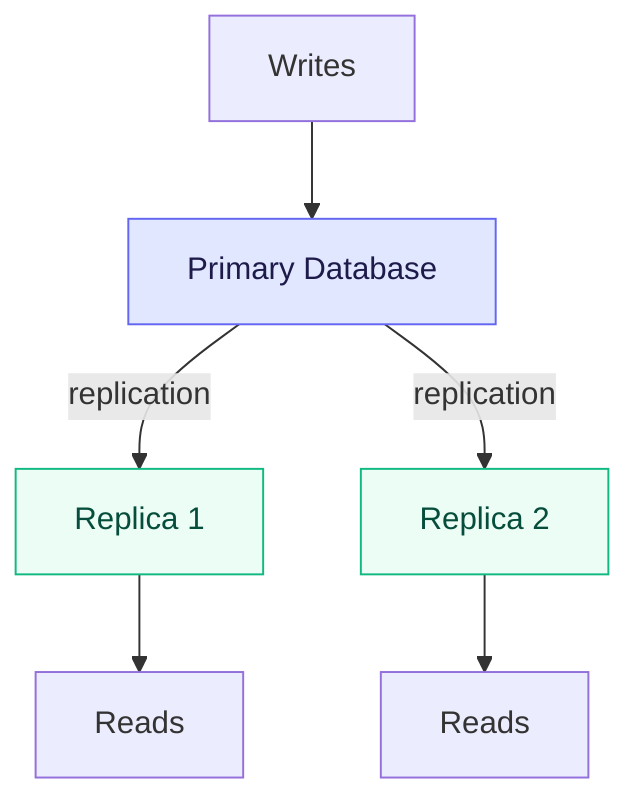
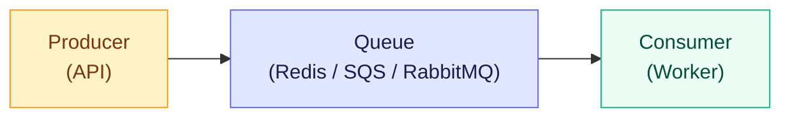
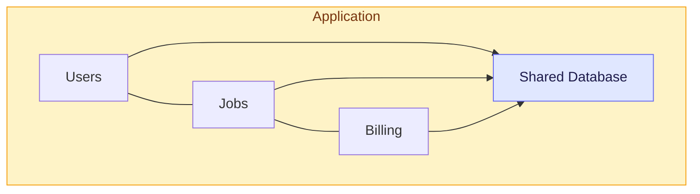
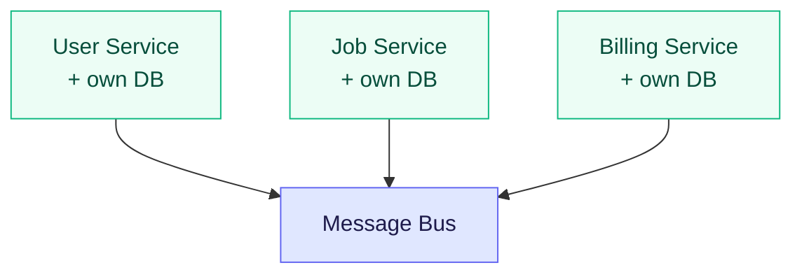

# System Design Guide

A comprehensive guide to system design concepts, patterns, and interview preparation for full-stack developers.

---

## Table of Contents

1. [Fundamentals](#1-fundamentals)
2. [Scalability](#2-scalability)
3. [Load Balancing](#3-load-balancing)
4. [Caching](#4-caching)
5. [Database Design](#5-database-design)
6. [Message Queues & Event-Driven Architecture](#6-message-queues--event-driven-architecture)
7. [Microservices Architecture](#7-microservices-architecture)
8. [API Gateway](#8-api-gateway)
9. [CDN (Content Delivery Network)](#9-cdn-content-delivery-network)
10. [Rate Limiting & Throttling](#10-rate-limiting--throttling)
11. [Monitoring & Observability](#11-monitoring--observability)
12. [Security](#12-security)
13. [Real-Time Communication](#13-real-time-communication)
14. [File Storage & Upload](#14-file-storage--upload)
15. [Search Systems](#15-search-systems)
16. [Common System Design Patterns](#16-common-system-design-patterns)
17. [Design Case Studies](#17-design-case-studies)
18. [Interview Questions](#18-interview-questions)

---

## 1. Fundamentals

### What is System Design?

System design is the process of defining the architecture, components, modules, interfaces, and data flow of a system to satisfy specified requirements. It bridges the gap between requirements and implementation.

### Key Concepts

#### Latency vs Throughput

- **Latency**: Time taken for a single request to complete (milliseconds)
- **Throughput**: Number of requests a system can handle per unit time (requests/second)

```
Latency Examples:
- L1 cache reference:          0.5 ns
- RAM reference:               100 ns
- SSD read:                    150 us
- HDD seek:                    10 ms
- Round trip within datacenter: 0.5 ms
- Internet round trip:          150 ms
```

#### CAP Theorem

A distributed system can only guarantee two of three properties:

- **Consistency**: Every read receives the most recent write
- **Availability**: Every request receives a response (not guaranteed to be the latest)
- **Partition Tolerance**: System continues to operate despite network partitions

```
CP Systems: MongoDB, Redis, HBase
  - Sacrifice availability during partitions
  - Always return consistent data

AP Systems: Cassandra, DynamoDB, CouchDB
  - Sacrifice consistency during partitions
  - Always respond, but data may be stale

CA Systems: Traditional RDBMS (single node)
  - Not practical in distributed systems
  - Network partitions are inevitable
```

#### ACID vs BASE

```
ACID (Traditional RDBMS):
- Atomicity:    All or nothing transactions
- Consistency:  Data always valid according to rules
- Isolation:    Concurrent transactions don't interfere
- Durability:   Committed data survives failures

BASE (NoSQL / Distributed):
- Basically Available:  System always responds
- Soft state:           State may change over time
- Eventually consistent: System becomes consistent eventually
```

### Estimation & Back-of-the-Envelope Calculations

```
Powers of 2:
- 2^10 = 1 Thousand    = 1 KB
- 2^20 = 1 Million     = 1 MB
- 2^30 = 1 Billion     = 1 GB
- 2^40 = 1 Trillion    = 1 TB

Common Estimations:
- 1 day = 86,400 seconds ~ 100K seconds
- 1 month ~ 2.5 million seconds
- 1 year ~ 30 million seconds

QPS (Queries Per Second):
- 1 million DAU, each makes 10 requests/day
- QPS = 10M / 86400 ~ 116 QPS
- Peak QPS = QPS * 2-3 = ~300 QPS
```

---

## 2. Scalability

### Vertical Scaling (Scale Up)

Add more power to an existing machine (CPU, RAM, storage).

```
Pros:
- Simple to implement
- No application code changes
- No distributed system complexity

Cons:
- Hardware limits (can't scale indefinitely)
- Single point of failure
- Expensive at higher tiers
- Downtime during upgrades
```

### Horizontal Scaling (Scale Out)

Add more machines to the pool.

```
Pros:
- Virtually unlimited scaling
- Better fault tolerance
- Cost-effective (commodity hardware)
- No downtime for scaling

Cons:
- Application must handle distributed state
- More complex infrastructure
- Data consistency challenges
- Need load balancing
```

### Database Scaling Strategies

#### Read Replicas



#### Sharding (Horizontal Partitioning)

```javascript
// Hash-based sharding
function getShard(userId) {
  const shardCount = 4;
  return hash(userId) % shardCount;
}

// Range-based sharding
function getShard(userId) {
  if (userId < 1000000) return 'shard_1';
  if (userId < 2000000) return 'shard_2';
  if (userId < 3000000) return 'shard_3';
  return 'shard_4';
}

// Directory-based sharding
const shardMap = {
  'US': 'shard_us',
  'EU': 'shard_eu',
  'ASIA': 'shard_asia',
};
```

#### Consistent Hashing

Used to distribute data across nodes while minimizing redistribution when nodes are added/removed.

```
Traditional Hashing Problem:
- 4 servers: hash(key) % 4
- Add 1 server: hash(key) % 5
- Almost ALL keys need to be remapped!

Consistent Hashing:
- Arrange servers on a hash ring (0 to 2^32)
- Each key maps to the next server clockwise
- Adding/removing a server only affects neighbors
- Virtual nodes improve distribution

         Server A
           |
    ───────●───────
   /       |       \
  ●        |        ●  Server D
  Server B |
   \       |       /
    ───────●───────
           |
         Server C
```

---

## 3. Load Balancing

### Types of Load Balancers

```
Layer 4 (Transport Layer):
- Routes based on IP and TCP/UDP port
- Faster (no content inspection)
- Less flexible
- Examples: AWS NLB, HAProxy (TCP mode)

Layer 7 (Application Layer):
- Routes based on HTTP headers, URL, cookies
- More flexible (content-based routing)
- Can do SSL termination
- Examples: AWS ALB, Nginx, HAProxy (HTTP mode)
```

### Load Balancing Algorithms

```javascript
// 1. Round Robin
class RoundRobinBalancer {
  constructor(servers) {
    this.servers = servers;
    this.current = 0;
  }

  getNext() {
    const server = this.servers[this.current];
    this.current = (this.current + 1) % this.servers.length;
    return server;
  }
}

// 2. Weighted Round Robin
class WeightedRoundRobin {
  constructor(servers) {
    // servers = [{ address: 'A', weight: 3 }, { address: 'B', weight: 1 }]
    this.pool = [];
    for (const server of servers) {
      for (let i = 0; i < server.weight; i++) {
        this.pool.push(server.address);
      }
    }
    this.current = 0;
  }

  getNext() {
    const server = this.pool[this.current];
    this.current = (this.current + 1) % this.pool.length;
    return server;
  }
}

// 3. Least Connections
class LeastConnectionsBalancer {
  constructor(servers) {
    this.connections = new Map(servers.map(s => [s, 0]));
  }

  getNext() {
    let min = Infinity;
    let selected = null;
    for (const [server, count] of this.connections) {
      if (count < min) {
        min = count;
        selected = server;
      }
    }
    this.connections.set(selected, min + 1);
    return selected;
  }

  release(server) {
    const count = this.connections.get(server);
    this.connections.set(server, Math.max(0, count - 1));
  }
}

// 4. IP Hash (sticky sessions)
function ipHashBalance(clientIP, servers) {
  const hash = simpleHash(clientIP);
  return servers[hash % servers.length];
}
```

### Health Checks

```nginx
# Nginx health check configuration
upstream backend {
    server backend1:3000;
    server backend2:3000;
    server backend3:3000 backup;

    # Health check every 10s, 3 failures = mark down
    health_check interval=10s fails=3 passes=2;
}
```

---

## 4. Caching

### Caching Strategies

#### Cache-Aside (Lazy Loading)

```javascript
async function getUser(userId) {
  // 1. Check cache
  const cached = await redis.get(`user:${userId}`);
  if (cached) return JSON.parse(cached);

  // 2. Cache miss — read from DB
  const user = await db.users.findById(userId);

  // 3. Populate cache
  await redis.setex(`user:${userId}`, 3600, JSON.stringify(user));

  return user;
}
```

#### Write-Through

```javascript
async function updateUser(userId, data) {
  // 1. Write to DB
  const user = await db.users.findByIdAndUpdate(userId, data, { new: true });

  // 2. Write to cache (synchronously)
  await redis.setex(`user:${userId}`, 3600, JSON.stringify(user));

  return user;
}
```

#### Write-Behind (Write-Back)

```javascript
async function updateUser(userId, data) {
  // 1. Write to cache immediately
  await redis.setex(`user:${userId}`, 3600, JSON.stringify(data));

  // 2. Queue async write to DB
  await messageQueue.publish('db-writes', {
    collection: 'users',
    operation: 'update',
    id: userId,
    data,
  });
}

// Background worker processes the queue
async function processDbWrite(message) {
  await db.users.findByIdAndUpdate(message.id, message.data);
}
```

### Cache Eviction Policies

```
LRU (Least Recently Used):
- Evict the item that was accessed longest ago
- Good for: most use cases, temporal locality

LFU (Least Frequently Used):
- Evict the item with the fewest accesses
- Good for: items with stable access patterns

TTL (Time to Live):
- Items expire after a set duration
- Good for: data that changes at known intervals

FIFO (First In, First Out):
- Evict the oldest item
- Simple but less effective
```

### Multi-Level Caching

```
Request → Browser Cache (L1)
       → CDN Cache (L2)
       → API Gateway Cache (L3)
       → Application Cache / Redis (L4)
       → Database Query Cache (L5)
       → Database
```

### Cache Invalidation Patterns

```javascript
// 1. TTL-based expiration
await redis.setex('key', 300, 'value'); // expires in 5 min

// 2. Event-driven invalidation
async function updateProduct(productId, data) {
  await db.products.update(productId, data);
  await redis.del(`product:${productId}`);
  await redis.del('product-list'); // invalidate list cache too
}

// 3. Tag-based invalidation
async function invalidateByTag(tag) {
  const keys = await redis.smembers(`tag:${tag}`);
  if (keys.length > 0) {
    await redis.del(...keys);
    await redis.del(`tag:${tag}`);
  }
}

// When caching, register tags
async function cacheWithTags(key, value, tags) {
  await redis.setex(key, 3600, JSON.stringify(value));
  for (const tag of tags) {
    await redis.sadd(`tag:${tag}`, key);
  }
}
```

### Redis Caching in Node.js

```javascript
import Redis from 'ioredis';

const redis = new Redis({
  host: 'localhost',
  port: 6379,
  retryDelayOnFailover: 100,
  maxRetriesPerRequest: 3,
});

// Cache middleware for Express
function cacheMiddleware(ttl = 300) {
  return async (req, res, next) => {
    const key = `cache:${req.originalUrl}`;
    const cached = await redis.get(key);

    if (cached) {
      return res.json(JSON.parse(cached));
    }

    // Override res.json to cache the response
    const originalJson = res.json.bind(res);
    res.json = (data) => {
      redis.setex(key, ttl, JSON.stringify(data));
      return originalJson(data);
    };

    next();
  };
}

// Usage
app.get('/api/products', cacheMiddleware(600), getProducts);
```

---

## 5. Database Design

### SQL vs NoSQL Decision Matrix

```
Choose SQL (PostgreSQL, MySQL) when:
- Complex queries with JOINs
- ACID transactions required
- Data has clear relationships
- Schema is well-defined and stable
- Reporting / analytics needs

Choose NoSQL (MongoDB, DynamoDB) when:
- Schema evolves frequently
- Massive scale needed (horizontal)
- Hierarchical / nested data
- High write throughput
- Low-latency reads for simple queries

Choose In-Memory (Redis, Memcached) when:
- Sub-millisecond latency needed
- Session storage
- Caching layer
- Real-time leaderboards / counters
- Pub/sub messaging

Choose Graph DB (Neo4j, Amazon Neptune) when:
- Complex relationship traversals
- Social networks
- Recommendation engines
- Fraud detection
```

### Database Indexing

```javascript
// MongoDB index examples

// Single field index
db.users.createIndex({ email: 1 }); // ascending

// Compound index (order matters!)
db.orders.createIndex({ userId: 1, createdAt: -1 });

// Unique index
db.users.createIndex({ email: 1 }, { unique: true });

// Text index (full-text search)
db.articles.createIndex({ title: 'text', body: 'text' });

// TTL index (auto-delete after time)
db.sessions.createIndex({ createdAt: 1 }, { expireAfterSeconds: 3600 });

// Partial index (index subset of documents)
db.orders.createIndex(
  { status: 1 },
  { partialFilterExpression: { status: 'active' } }
);
```

### Replication

```
Primary-Replica (Master-Slave):

  Client          Client          Client
    │               │               │
    │ write         │ read          │ read
    ▼               ▼               ▼
┌────────┐    ┌──────────┐    ┌──────────┐
│ Primary │───│ Replica 1 │───│ Replica 2 │
│ (Write) │   │  (Read)   │   │  (Read)   │
└────────┘    └──────────┘    └──────────┘
      │           replication
      └──────────────────────────────────┘

Primary-Primary (Multi-Master):
- Both nodes accept writes
- Conflict resolution needed
- Higher availability
- More complex
```

---

## 6. Message Queues & Event-Driven Architecture

### Message Queue Pattern



### Use Cases

```
1. Async Processing:
   User uploads resume → Queue → Worker parses & indexes

2. Decoupling Services:
   Order Service → Queue → Inventory Service
                        → Payment Service
                        → Notification Service

3. Rate Limiting:
   Burst of requests → Queue → Process at steady rate

4. Retry Logic:
   Failed job → Dead letter queue → Retry with backoff
```

### Bull Queue with Redis (Node.js)

```javascript
import Queue from 'bull';

// Create a queue
const emailQueue = new Queue('email', {
  redis: { host: 'localhost', port: 6379 },
  defaultJobOptions: {
    attempts: 3,
    backoff: { type: 'exponential', delay: 2000 },
    removeOnComplete: 100,
    removeOnFail: 500,
  },
});

// Producer: Add jobs
async function sendWelcomeEmail(userId, email) {
  await emailQueue.add(
    'welcome',
    { userId, email, template: 'welcome' },
    { priority: 1, delay: 5000 } // send after 5s
  );
}

// Consumer: Process jobs
emailQueue.process('welcome', 5, async (job) => {
  const { userId, email, template } = job.data;
  await sendEmail(email, template);
  return { sent: true };
});

// Event listeners
emailQueue.on('completed', (job, result) => {
  console.log(`Job ${job.id} completed:`, result);
});

emailQueue.on('failed', (job, err) => {
  console.error(`Job ${job.id} failed:`, err.message);
});
```

### Event-Driven Architecture

```javascript
// Event bus pattern
import { EventEmitter } from 'events';

class EventBus extends EventEmitter {
  async publish(event, data) {
    // Persist event for replay
    await db.events.insertOne({
      event,
      data,
      timestamp: new Date(),
    });
    this.emit(event, data);
  }
}

const bus = new EventBus();

// Subscribe to events
bus.on('order.created', async (order) => {
  await inventoryService.reserve(order.items);
});

bus.on('order.created', async (order) => {
  await notificationService.sendConfirmation(order.userId);
});

bus.on('order.created', async (order) => {
  await analyticsService.trackOrder(order);
});

// Publish event
await bus.publish('order.created', {
  orderId: '123',
  userId: 'user-456',
  items: [{ sku: 'ITEM-1', qty: 2 }],
  total: 59.99,
});
```

### Event Sourcing

```javascript
// Instead of storing current state, store all events
class OrderAggregate {
  constructor() {
    this.state = { status: 'new', items: [], total: 0 };
    this.events = [];
  }

  // Apply events to build state
  apply(event) {
    switch (event.type) {
      case 'ORDER_CREATED':
        this.state = { ...this.state, id: event.data.orderId, status: 'created' };
        break;
      case 'ITEM_ADDED':
        this.state.items.push(event.data.item);
        this.state.total += event.data.item.price;
        break;
      case 'ORDER_PAID':
        this.state.status = 'paid';
        break;
      case 'ORDER_SHIPPED':
        this.state.status = 'shipped';
        break;
    }
    this.events.push(event);
  }

  // Rebuild state from event history
  static fromEvents(events) {
    const order = new OrderAggregate();
    events.forEach((e) => order.apply(e));
    return order;
  }
}
```

---

## 7. Microservices Architecture

### Monolith vs Microservices

**Monolith:**



**Microservices:**



### Service Communication

```javascript
// 1. Synchronous (HTTP/REST)
// Service A calls Service B directly
async function getUserOrders(userId) {
  const user = await fetch('http://user-service/users/' + userId);
  const orders = await fetch('http://order-service/orders?userId=' + userId);
  return { user: await user.json(), orders: await orders.json() };
}

// 2. Asynchronous (Message Queue)
// Service A publishes event, Service B consumes
async function createOrder(orderData) {
  const order = await db.orders.create(orderData);

  // Publish event — other services react independently
  await messageQueue.publish('order.created', {
    orderId: order.id,
    userId: order.userId,
    amount: order.total,
  });

  return order;
}

// 3. gRPC (high-performance binary protocol)
// Defined via .proto files, generates typed clients
// Best for internal service-to-service calls
```

### Circuit Breaker Pattern

```javascript
class CircuitBreaker {
  constructor(options = {}) {
    this.failureThreshold = options.failureThreshold || 5;
    this.resetTimeout = options.resetTimeout || 30000;
    this.state = 'CLOSED'; // CLOSED, OPEN, HALF_OPEN
    this.failureCount = 0;
    this.lastFailureTime = null;
  }

  async execute(fn) {
    if (this.state === 'OPEN') {
      if (Date.now() - this.lastFailureTime > this.resetTimeout) {
        this.state = 'HALF_OPEN';
      } else {
        throw new Error('Circuit is OPEN — request blocked');
      }
    }

    try {
      const result = await fn();
      this.onSuccess();
      return result;
    } catch (error) {
      this.onFailure();
      throw error;
    }
  }

  onSuccess() {
    this.failureCount = 0;
    this.state = 'CLOSED';
  }

  onFailure() {
    this.failureCount++;
    this.lastFailureTime = Date.now();
    if (this.failureCount >= this.failureThreshold) {
      this.state = 'OPEN';
    }
  }
}

// Usage
const breaker = new CircuitBreaker({ failureThreshold: 3, resetTimeout: 10000 });

async function callExternalService() {
  return breaker.execute(async () => {
    const res = await fetch('http://payment-service/charge');
    if (!res.ok) throw new Error('Payment service error');
    return res.json();
  });
}
```

### Saga Pattern (Distributed Transactions)

```javascript
// Choreography-based saga (event-driven)
// Each service listens for events and publishes compensating events on failure

// Orchestration-based saga (coordinator)
class OrderSaga {
  async execute(orderData) {
    const steps = [];

    try {
      // Step 1: Reserve inventory
      const reservation = await inventoryService.reserve(orderData.items);
      steps.push({ service: 'inventory', action: 'release', data: reservation });

      // Step 2: Process payment
      const payment = await paymentService.charge(orderData.amount);
      steps.push({ service: 'payment', action: 'refund', data: payment });

      // Step 3: Create shipping
      const shipping = await shippingService.create(orderData.address);
      steps.push({ service: 'shipping', action: 'cancel', data: shipping });

      return { success: true, orderId: orderData.id };
    } catch (error) {
      // Compensate — undo steps in reverse order
      for (const step of steps.reverse()) {
        await this.compensate(step);
      }
      return { success: false, error: error.message };
    }
  }

  async compensate(step) {
    switch (step.service) {
      case 'inventory':
        await inventoryService.release(step.data);
        break;
      case 'payment':
        await paymentService.refund(step.data);
        break;
      case 'shipping':
        await shippingService.cancel(step.data);
        break;
    }
  }
}
```

---

## 8. API Gateway

### Responsibilities

```
Client Request → API Gateway → Microservice

API Gateway handles:
1. Request routing
2. Authentication / Authorization
3. Rate limiting
4. Request/response transformation
5. Load balancing
6. Circuit breaking
7. Caching
8. Logging & monitoring
9. SSL termination
10. API versioning
```

### Express API Gateway Example

```javascript
import express from 'express';
import { createProxyMiddleware } from 'http-proxy-middleware';

const app = express();

// Auth middleware
app.use(async (req, res, next) => {
  const token = req.headers.authorization?.split(' ')[1];
  if (!token) return res.status(401).json({ error: 'Unauthorized' });

  try {
    req.user = await verifyToken(token);
    next();
  } catch {
    res.status(401).json({ error: 'Invalid token' });
  }
});

// Rate limiting
app.use(rateLimit({ windowMs: 15 * 60 * 1000, max: 100 }));

// Route to microservices
app.use(
  '/api/users',
  createProxyMiddleware({
    target: 'http://user-service:3001',
    pathRewrite: { '^/api/users': '/users' },
  })
);

app.use(
  '/api/orders',
  createProxyMiddleware({
    target: 'http://order-service:3002',
    pathRewrite: { '^/api/orders': '/orders' },
  })
);

app.use(
  '/api/products',
  createProxyMiddleware({
    target: 'http://product-service:3003',
    pathRewrite: { '^/api/products': '/products' },
  })
);
```

### BFF (Backend for Frontend)

```
Mobile App  ──→  Mobile BFF  ──→  Microservices
Web App     ──→  Web BFF     ──→  Microservices
Admin Panel ──→  Admin BFF   ──→  Microservices

Each BFF:
- Aggregates data from multiple services
- Formats response for specific client needs
- Handles client-specific auth flows
- Reduces over-fetching for mobile
```

---

## 9. CDN (Content Delivery Network)

### How CDNs Work

```
Without CDN:
User (Tokyo) ──── 200ms ────> Origin (US East)

With CDN:
User (Tokyo) ── 20ms ──> Edge (Tokyo) ── cache hit ──> Response
                              │
                         cache miss
                              │
                              ▼
                     Origin (US East)
```

### CDN Configuration

```javascript
// CloudFront distribution with S3 origin
const distribution = {
  Origins: [{
    DomainName: 'my-bucket.s3.amazonaws.com',
    S3OriginConfig: {
      OriginAccessIdentity: 'origin-access-identity/cloudfront/XXXXX',
    },
  }],
  DefaultCacheBehavior: {
    ViewerProtocolPolicy: 'redirect-to-https',
    CachePolicyId: 'managed-caching-optimized',
    TTL: {
      Default: 86400,  // 1 day
      Max: 31536000,   // 1 year
      Min: 0,
    },
    Compress: true,
  },
  // Custom error pages for SPA routing
  CustomErrorResponses: [{
    ErrorCode: 403,
    ResponseCode: 200,
    ResponsePagePath: '/index.html',
    ErrorCachingMinTTL: 300,
  }],
};

// Cache busting via content hash in filenames
// index-a1b2c3d4.js  → immutable, cache forever
// index.html          → no-cache, always revalidate
```

### Caching Headers

```
Cache-Control: public, max-age=31536000, immutable
  → Static assets with content hash (JS, CSS, images)

Cache-Control: no-cache
  → HTML files (always revalidate, may serve cached if fresh)

Cache-Control: no-store
  → Sensitive data (never cache)

Cache-Control: public, max-age=3600, stale-while-revalidate=86400
  → API responses (serve stale while fetching fresh)
```

---

## 10. Rate Limiting & Throttling

### Algorithms

#### Token Bucket

```javascript
class TokenBucket {
  constructor(capacity, refillRate) {
    this.capacity = capacity;
    this.tokens = capacity;
    this.refillRate = refillRate; // tokens per second
    this.lastRefill = Date.now();
  }

  consume(tokens = 1) {
    this.refill();
    if (this.tokens >= tokens) {
      this.tokens -= tokens;
      return true;
    }
    return false;
  }

  refill() {
    const now = Date.now();
    const elapsed = (now - this.lastRefill) / 1000;
    this.tokens = Math.min(this.capacity, this.tokens + elapsed * this.refillRate);
    this.lastRefill = now;
  }
}
```

#### Sliding Window

```javascript
class SlidingWindowRateLimiter {
  constructor(windowMs, maxRequests) {
    this.windowMs = windowMs;
    this.maxRequests = maxRequests;
    this.requests = new Map(); // userId → timestamps[]
  }

  isAllowed(userId) {
    const now = Date.now();
    const windowStart = now - this.windowMs;

    // Get user's request timestamps
    const timestamps = this.requests.get(userId) || [];

    // Filter to current window
    const recent = timestamps.filter((t) => t > windowStart);

    if (recent.length >= this.maxRequests) {
      return false;
    }

    recent.push(now);
    this.requests.set(userId, recent);
    return true;
  }
}
```

### Redis-based Rate Limiting

```javascript
import Redis from 'ioredis';

const redis = new Redis();

async function rateLimitMiddleware(req, res, next) {
  const key = `ratelimit:${req.ip}`;
  const limit = 100;
  const window = 60; // seconds

  const current = await redis.incr(key);
  if (current === 1) {
    await redis.expire(key, window);
  }

  res.set({
    'X-RateLimit-Limit': limit,
    'X-RateLimit-Remaining': Math.max(0, limit - current),
    'X-RateLimit-Reset': await redis.ttl(key),
  });

  if (current > limit) {
    return res.status(429).json({
      error: 'Too many requests',
      retryAfter: await redis.ttl(key),
    });
  }

  next();
}
```

---

## 11. Monitoring & Observability

### Three Pillars

```
1. Logging (What happened)
   - Structured JSON logs
   - Log levels: error, warn, info, debug
   - Centralized log aggregation (ELK, CloudWatch)

2. Metrics (What's the system doing)
   - Request rate, error rate, latency (RED)
   - Utilization, saturation, errors (USE)
   - Business metrics (signups, orders)

3. Tracing (How did it flow)
   - Distributed request tracing
   - Trace ID propagated across services
   - Span timing for each service hop
```

### Structured Logging

```javascript
import winston from 'winston';

const logger = winston.createLogger({
  level: 'info',
  format: winston.format.combine(
    winston.format.timestamp(),
    winston.format.json()
  ),
  defaultMeta: { service: 'user-service' },
  transports: [
    new winston.transports.Console(),
    new winston.transports.File({ filename: 'error.log', level: 'error' }),
  ],
});

// Usage
logger.info('User created', {
  userId: '123',
  email: 'user@example.com',
  duration: 45,
  traceId: req.headers['x-trace-id'],
});

logger.error('Payment failed', {
  orderId: '456',
  error: error.message,
  stack: error.stack,
  traceId: req.headers['x-trace-id'],
});
```

### Health Check Endpoint

```javascript
app.get('/health', async (req, res) => {
  const checks = {
    uptime: process.uptime(),
    timestamp: Date.now(),
    checks: {},
  };

  // Database check
  try {
    await db.command({ ping: 1 });
    checks.checks.database = { status: 'healthy' };
  } catch (e) {
    checks.checks.database = { status: 'unhealthy', error: e.message };
  }

  // Redis check
  try {
    await redis.ping();
    checks.checks.redis = { status: 'healthy' };
  } catch (e) {
    checks.checks.redis = { status: 'unhealthy', error: e.message };
  }

  const isHealthy = Object.values(checks.checks).every(
    (c) => c.status === 'healthy'
  );

  res.status(isHealthy ? 200 : 503).json(checks);
});
```

---

## 12. Security

### Defense in Depth

```
Layer 1: Network (Firewall, VPC, Security Groups)
Layer 2: Transport (TLS/SSL, certificate pinning)
Layer 3: Application (Input validation, CSRF, XSS prevention)
Layer 4: Authentication (JWT, OAuth, MFA)
Layer 5: Authorization (RBAC, ABAC)
Layer 6: Data (Encryption at rest, field-level encryption)
Layer 7: Monitoring (Intrusion detection, audit logs)
```

### Common Security Patterns

```javascript
// 1. Input validation
import Joi from 'joi';

const userSchema = Joi.object({
  email: Joi.string().email().required(),
  password: Joi.string().min(8).max(128).required(),
  name: Joi.string().max(100).required(),
});

// 2. SQL injection prevention (parameterized queries)
// BAD
const query = `SELECT * FROM users WHERE email = '${email}'`;
// GOOD
const query = 'SELECT * FROM users WHERE email = $1';
await db.query(query, [email]);

// 3. XSS prevention
import DOMPurify from 'dompurify';
const sanitized = DOMPurify.sanitize(userInput);

// 4. CORS configuration
app.use(cors({
  origin: ['https://app.example.com'],
  credentials: true,
  methods: ['GET', 'POST', 'PUT', 'DELETE'],
  allowedHeaders: ['Content-Type', 'Authorization'],
}));

// 5. Security headers
import helmet from 'helmet';
app.use(helmet());
// Sets: X-Content-Type-Options, X-Frame-Options,
//       Strict-Transport-Security, Content-Security-Policy, etc.

// 6. Rate limiting (see section 10)
```

---

## 13. Real-Time Communication

### WebSocket

```javascript
// Server (ws library)
import { WebSocketServer } from 'ws';

const wss = new WebSocketServer({ port: 8080 });

const rooms = new Map(); // roomId → Set<WebSocket>

wss.on('connection', (ws, req) => {
  ws.on('message', (data) => {
    const message = JSON.parse(data);

    switch (message.type) {
      case 'join':
        if (!rooms.has(message.room)) rooms.set(message.room, new Set());
        rooms.get(message.room).add(ws);
        ws.room = message.room;
        break;

      case 'message':
        // Broadcast to room
        const members = rooms.get(ws.room) || new Set();
        for (const client of members) {
          if (client !== ws && client.readyState === 1) {
            client.send(JSON.stringify(message));
          }
        }
        break;
    }
  });

  ws.on('close', () => {
    if (ws.room && rooms.has(ws.room)) {
      rooms.get(ws.room).delete(ws);
    }
  });
});
```

### Server-Sent Events (SSE)

```javascript
// Server
app.get('/events', (req, res) => {
  res.writeHead(200, {
    'Content-Type': 'text/event-stream',
    'Cache-Control': 'no-cache',
    Connection: 'keep-alive',
  });

  const sendEvent = (data) => {
    res.write(`data: ${JSON.stringify(data)}\n\n`);
  };

  // Send updates
  const interval = setInterval(() => {
    sendEvent({ type: 'heartbeat', timestamp: Date.now() });
  }, 30000);

  req.on('close', () => clearInterval(interval));
});

// Client
const eventSource = new EventSource('/events');
eventSource.onmessage = (event) => {
  const data = JSON.parse(event.data);
  console.log('Received:', data);
};
```

### Comparison

```
WebSocket:
- Full duplex (bidirectional)
- Binary + text data
- Custom protocol (ws://)
- Use for: chat, gaming, collaboration

SSE (Server-Sent Events):
- Server → Client only (unidirectional)
- Text data only
- HTTP protocol
- Auto-reconnect built-in
- Use for: notifications, live feeds, dashboards

Long Polling:
- Client polls repeatedly
- Higher latency, more overhead
- Works everywhere
- Use for: fallback when WS/SSE unavailable
```

---

## 14. File Storage & Upload

### Architecture

```
Client → API Server → Object Storage (S3)
         │
         ├── Small files: direct upload through API
         └── Large files: presigned URL (direct to S3)
```

### Presigned URL Upload

```javascript
import { S3Client, PutObjectCommand, GetObjectCommand } from '@aws-sdk/client-s3';
import { getSignedUrl } from '@aws-sdk/s3-request-presigner';

const s3 = new S3Client({ region: 'us-east-1' });

// Generate presigned upload URL
async function getUploadUrl(fileName, contentType) {
  const key = `uploads/${Date.now()}-${fileName}`;

  const command = new PutObjectCommand({
    Bucket: 'my-bucket',
    Key: key,
    ContentType: contentType,
  });

  const url = await getSignedUrl(s3, command, { expiresIn: 3600 });
  return { url, key };
}

// Generate presigned download URL
async function getDownloadUrl(key) {
  const command = new GetObjectCommand({
    Bucket: 'my-bucket',
    Key: key,
  });

  return getSignedUrl(s3, command, { expiresIn: 3600 });
}

// API routes
app.post('/api/upload-url', async (req, res) => {
  const { fileName, contentType } = req.body;
  const { url, key } = await getUploadUrl(fileName, contentType);
  res.json({ uploadUrl: url, key });
});
```

### Chunked Upload for Large Files

```javascript
// Client-side chunked upload
async function uploadLargeFile(file, chunkSize = 5 * 1024 * 1024) {
  // 1. Initialize multipart upload
  const { uploadId } = await api.post('/upload/init', {
    fileName: file.name,
    contentType: file.type,
  });

  // 2. Upload chunks in parallel
  const chunks = Math.ceil(file.size / chunkSize);
  const parts = [];

  for (let i = 0; i < chunks; i++) {
    const start = i * chunkSize;
    const end = Math.min(start + chunkSize, file.size);
    const chunk = file.slice(start, end);

    const { url } = await api.post('/upload/part-url', {
      uploadId,
      partNumber: i + 1,
    });

    const response = await fetch(url, {
      method: 'PUT',
      body: chunk,
    });

    parts.push({
      partNumber: i + 1,
      etag: response.headers.get('etag'),
    });
  }

  // 3. Complete multipart upload
  await api.post('/upload/complete', { uploadId, parts });
}
```

---

## 15. Search Systems

### Full-Text Search with Elasticsearch

```javascript
// Index document
await esClient.index({
  index: 'jobs',
  body: {
    title: 'Senior React Developer',
    description: 'Building scalable web applications...',
    skills: ['React', 'TypeScript', 'Node.js'],
    location: 'San Francisco',
    salary: { min: 150000, max: 200000 },
    postedAt: new Date(),
  },
});

// Search with relevance scoring
const results = await esClient.search({
  index: 'jobs',
  body: {
    query: {
      bool: {
        must: [
          {
            multi_match: {
              query: 'react developer',
              fields: ['title^3', 'description', 'skills^2'],
            },
          },
        ],
        filter: [
          { range: { 'salary.min': { gte: 100000 } } },
          { term: { location: 'San Francisco' } },
        ],
      },
    },
    highlight: {
      fields: { title: {}, description: {} },
    },
    sort: [{ _score: 'desc' }, { postedAt: 'desc' }],
    from: 0,
    size: 20,
  },
});
```

### Search Architecture

```
Write Path:
App → Database → Change Stream/Binlog → Sync Service → Search Index

Read Path:
User Query → API → Search Index → Results
                                     │
                              Hydrate from DB
                                     │
                                  Response

Components:
- Search Index (Elasticsearch/OpenSearch): inverted index, fast text search
- Sync Service: keeps search index in sync with primary DB
- Tokenizer: breaks text into searchable tokens
- Analyzer: stemming, stop words, synonyms
```

---

## 16. Common System Design Patterns

### CQRS (Command Query Responsibility Segregation)

```
Commands (Write):
Client → API → Command Handler → Write DB

Queries (Read):
Client → API → Query Handler → Read DB (optimized views)

Write DB ──sync──> Read DB (denormalized, optimized for reads)
```

### Strangler Fig (Migrating from Monolith)

```
Phase 1: Route all traffic through proxy
  Client → Proxy → Monolith

Phase 2: Migrate features one by one
  Client → Proxy → New Service (feature A)
                 → Monolith (features B, C, D)

Phase 3: Complete migration
  Client → Proxy → Service A
                 → Service B
                 → Service C
                 → Service D
```

### Bulkhead Pattern

```javascript
// Isolate different parts of the system
// so failure in one doesn't cascade

class BulkheadExecutor {
  constructor(name, maxConcurrent) {
    this.name = name;
    this.maxConcurrent = maxConcurrent;
    this.running = 0;
    this.queue = [];
  }

  async execute(fn) {
    if (this.running >= this.maxConcurrent) {
      await new Promise((resolve) => this.queue.push(resolve));
    }

    this.running++;
    try {
      return await fn();
    } finally {
      this.running--;
      if (this.queue.length > 0) {
        this.queue.shift()();
      }
    }
  }
}

// Separate bulkheads per dependency
const paymentBulkhead = new BulkheadExecutor('payment', 10);
const emailBulkhead = new BulkheadExecutor('email', 20);
const searchBulkhead = new BulkheadExecutor('search', 50);
```

### Idempotency

```javascript
// Ensure operations can be safely retried
async function processPayment(req, res) {
  const idempotencyKey = req.headers['idempotency-key'];

  // Check if already processed
  const existing = await redis.get(`idem:${idempotencyKey}`);
  if (existing) {
    return res.json(JSON.parse(existing));
  }

  // Process payment
  const result = await paymentGateway.charge(req.body);

  // Store result for idempotency
  await redis.setex(`idem:${idempotencyKey}`, 86400, JSON.stringify(result));

  res.json(result);
}
```

---

## 17. Design Case Studies

### URL Shortener (TinyURL)

```
Requirements:
- Shorten long URLs → short alias
- Redirect short URL → original
- Custom aliases (optional)
- Analytics (click count)
- High availability, low latency

Estimation (100M URLs/month):
- Write QPS: 100M / (30 * 86400) ≈ 40/s
- Read QPS: 10x writes = 400/s (80/20 rule)
- Storage: 100M * 500 bytes = 50 GB/month

Architecture:
┌────────┐    ┌─────────┐    ┌──────┐
│ Client │───>│  API GW  │───>│ App  │
└────────┘    └─────────┘    └──┬───┘
                                │
                    ┌───────────┼───────────┐
                    │           │           │
                ┌───┴───┐  ┌───┴───┐  ┌───┴────┐
                │ Redis  │  │  DB   │  │ Counter│
                │ Cache  │  │(URLs) │  │  (Zk)  │
                └───────┘  └───────┘  └────────┘

Key Design:
- Base62 encoding: [a-zA-Z0-9] → 62^7 = 3.5 trillion combinations
- Counter-based (Zookeeper) vs hash-based ID generation
- Read-heavy → cache popular URLs in Redis
- 301 (permanent) vs 302 (temporary) redirect
```

### Chat System

```
Requirements:
- 1:1 and group messaging
- Online/offline status
- Message persistence
- Read receipts
- Real-time delivery

Architecture:
┌────────┐    ┌──────────┐    ┌────────────┐
│Client A │──>│WebSocket │───>│   Chat     │
└────────┘    │  Server   │   │  Service   │
              └──────────┘    └─────┬──────┘
                                    │
              ┌─────────────────────┼──────────────┐
              │                     │              │
         ┌────┴────┐         ┌─────┴─────┐  ┌────┴────┐
         │ Message  │         │  Presence │  │  Push   │
         │  Store   │         │  Service  │  │Notific. │
         │(Cassandra)│        │  (Redis)  │  │         │
         └─────────┘         └──────────┘  └─────────┘

Message delivery:
1. Client A sends message → WebSocket server
2. Check if recipient online (Presence Service)
3. If online: deliver via WebSocket
4. If offline: store + push notification
5. Persist message in Message Store
6. Update conversation metadata

Schema (Cassandra):
- messages: partition by (chat_id), cluster by (timestamp DESC)
- conversations: partition by (user_id), cluster by (last_message_time DESC)
```

### Notification System

```
Requirements:
- Multi-channel: push, email, SMS, in-app
- Millions of notifications/day
- Templated messages
- User preferences (opt-out)
- Retry on failure

Architecture:
┌──────────┐    ┌────────────┐    ┌───────────┐
│ Trigger  │───>│Notification│───>│  Message   │
│ Service  │    │  Service   │    │   Queue    │
└──────────┘    └────────────┘    └─────┬─────┘
                                        │
                    ┌───────────────────┼───────────────────┐
                    │                   │                   │
              ┌─────┴─────┐      ┌─────┴─────┐      ┌─────┴─────┐
              │   Push    │      │   Email   │      │    SMS    │
              │  Worker   │      │  Worker   │      │  Worker   │
              └───────────┘      └───────────┘      └───────────┘

Flow:
1. Event triggers notification (order placed, etc.)
2. Notification service checks user preferences
3. Renders template with data
4. Enqueues to channel-specific queue
5. Workers send via provider (FCM, SES, Twilio)
6. Track delivery status, retry on failure
```

---

## 18. Interview Questions

### Beginner (1-3 years)

**Q1: What is the CAP theorem? Give an example of each type.**

The CAP theorem states a distributed system can guarantee at most two of three properties: Consistency (all nodes see the same data), Availability (every request gets a response), and Partition Tolerance (system works despite network failures).

- **CP**: MongoDB (primary/secondary) — during a network partition, the secondary becomes unavailable for writes to maintain consistency
- **AP**: Cassandra — continues serving reads/writes during partitions, but data may be temporarily inconsistent
- **CA**: A single-node PostgreSQL instance — no partition tolerance since it's not distributed

In practice, since network partitions are inevitable in distributed systems, you choose between CP and AP.

---

**Q2: What is the difference between vertical and horizontal scaling?**

**Vertical scaling** (scale up) means adding more resources to a single machine — more CPU, RAM, or storage. It's simpler (no code changes) but has hardware limits and creates a single point of failure.

**Horizontal scaling** (scale out) means adding more machines to the pool. It offers virtually unlimited scaling and better fault tolerance, but requires the application to handle distributed concerns like load balancing, data consistency, and session management.

Most production systems use horizontal scaling for the application tier and a mix of both for databases (vertical for primary, horizontal via sharding/replicas).

---

**Q3: Explain caching. What is cache-aside pattern?**

Caching stores frequently accessed data in a faster storage layer (like Redis) to reduce load on the primary database and improve response times.

**Cache-aside** (lazy loading): The application checks the cache first. On a cache hit, it returns the cached data. On a cache miss, it reads from the database, populates the cache, and returns the data. This pattern is simple and only caches data that's actually requested, but the first request for any item is always slower (cold cache), and data can become stale if the database changes without the cache being invalidated.

---

**Q4: What is a CDN and why would you use one?**

A CDN (Content Delivery Network) is a geographically distributed network of servers that caches content closer to users. Instead of every request hitting your origin server (which might be in one region), the CDN serves static assets (JS, CSS, images) from the nearest edge location.

Benefits: Reduced latency (users hit nearby edge servers), lower origin server load, DDoS protection, automatic failover. For SPAs, the CDN serves the static build files while API requests go to the backend.

---

**Q5: What is a load balancer and what algorithms can it use?**

A load balancer distributes incoming traffic across multiple servers to ensure no single server is overwhelmed.

Common algorithms:
- **Round Robin**: Requests distributed sequentially across servers
- **Weighted Round Robin**: Servers with more capacity get proportionally more traffic
- **Least Connections**: Routes to the server with fewest active connections
- **IP Hash**: Routes based on client IP (sticky sessions)
- **Random**: Simple random selection

Layer 4 load balancers route based on IP/port (faster), while Layer 7 route based on HTTP content like URL paths or headers (more flexible).

---

**Q6: What are WebSockets and when would you use them over REST?**

WebSockets provide a persistent, full-duplex communication channel over a single TCP connection. Unlike REST (request-response), WebSockets allow both client and server to send messages at any time.

Use WebSockets for: real-time chat, live notifications, collaborative editing, gaming, live dashboards, stock tickers.

Use REST for: CRUD operations, data fetching, file uploads, operations that don't need real-time updates.

SSE (Server-Sent Events) is a lighter alternative when you only need server-to-client streaming.

---

### Intermediate (3-5 years)

**Q7: How would you design a rate limiter?**

A rate limiter controls the rate of requests a user/client can make to an API.

**Token Bucket algorithm**: A bucket holds tokens up to a maximum capacity. Each request consumes a token. Tokens are added at a fixed rate. If the bucket is empty, the request is rejected. This allows bursts (up to bucket capacity) while maintaining an average rate.

**Sliding Window**: Track timestamps of recent requests per user. Count requests within the window. If count exceeds the limit, reject. More precise than fixed windows but uses more memory.

For distributed systems, use Redis with atomic operations (INCR + EXPIRE) to implement the counter across multiple API servers. Return `429 Too Many Requests` with `Retry-After` and `X-RateLimit-*` headers.

---

**Q8: Explain the circuit breaker pattern.**

The circuit breaker prevents cascading failures when a downstream service is unhealthy. It has three states:

1. **Closed** (normal): Requests flow through. Failures are counted.
2. **Open** (tripped): After exceeding the failure threshold, all requests immediately fail without calling the downstream service. A timer starts.
3. **Half-Open** (testing): After the timer expires, a limited number of test requests are allowed through. If they succeed, the circuit closes. If they fail, it reopens.

This prevents a failing service from being overwhelmed with retries and allows it time to recover, while the caller gets fast failure responses instead of hanging.

---

**Q9: Compare microservices vs monolith architecture.**

**Monolith**: Single deployable unit. All features share one codebase, one database, one deployment. Simpler to develop, test, debug, and deploy initially. But as it grows: longer build times, harder to scale individual features, one bug can take down everything, technology lock-in.

**Microservices**: Each feature is an independent service with its own database, deployment, and potentially tech stack. Benefits: independent scaling, team autonomy, isolated failures, technology diversity. Costs: distributed system complexity (networking, data consistency, debugging), operational overhead (many services to deploy/monitor), inter-service communication latency.

Start with a monolith and extract microservices when you have clear bounded contexts and team scaling needs.

---

**Q10: What is database sharding and what are its challenges?**

Sharding is horizontal partitioning of a database across multiple servers, each holding a subset of the data.

**Strategies**: Hash-based (hash(key) % N), range-based (e.g., users A-M on shard 1, N-Z on shard 2), directory-based (lookup table maps keys to shards).

**Challenges**:
- **Joins across shards** are expensive or impossible
- **Resharding** when adding servers (consistent hashing helps)
- **Hotspots** if sharding key isn't well-distributed
- **Referential integrity** can't be enforced across shards
- **Increased operational complexity** (backups, schema migrations across all shards)

---

**Q11: How does event-driven architecture work?**

In event-driven architecture, services communicate by producing and consuming events rather than making direct calls.

**Components**: Event producers (emit events when state changes), event bus/broker (routes events — Kafka, RabbitMQ, SNS), event consumers (react to events).

**Benefits**: Loose coupling (producer doesn't know consumers), async processing, easy to add new consumers, event log enables replay/audit.

**Patterns**: Event notification (just a signal), event-carried state transfer (event includes all data needed), event sourcing (store events as the source of truth, derive state).

**Challenges**: Eventual consistency, harder debugging (no linear call stack), event ordering, duplicate handling (idempotency).

---

**Q12: What is CQRS and when would you use it?**

CQRS (Command Query Responsibility Segregation) separates the write model (commands) from the read model (queries). Instead of one model for both reads and writes, you have:

- **Command side**: Handles creates/updates/deletes, optimized for write consistency
- **Query side**: Handles reads, uses denormalized views optimized for specific read patterns

The write database syncs to the read database (eventually consistent). Use CQRS when: read and write patterns differ significantly (e.g., write normalized, read denormalized), you need independent scaling of reads vs writes, or complex domain logic on writes but simple reads.

---

### Advanced (5+ years)

**Q13: Design a URL shortener (TinyURL).**

**Requirements**: Generate short URLs, redirect to original, custom aliases, analytics, 100M URLs/month.

**Key decisions**:
1. **ID generation**: Counter-based (Zookeeper for coordination) or hash-based (MD5/SHA → base62, take first 7 chars). Counter avoids collisions; hash is simpler but needs collision handling.
2. **Storage**: Key-value store (DynamoDB/Cassandra) for O(1) lookups. Schema: `{ shortUrl, longUrl, createdAt, userId, expiresAt }`.
3. **Caching**: Redis cache for hot URLs (80/20 rule — 20% of URLs get 80% of traffic). Cache on read, LRU eviction.
4. **Redirect**: 301 (permanent, cacheable by browser) vs 302 (temporary, every request hits server — better for analytics).
5. **Scale**: Stateless app servers behind a load balancer. Database sharding by short URL hash. CDN for popular URLs.

---

**Q14: Design a distributed message queue (like Kafka).**

**Core concepts**: Topics (named channels), partitions (ordered log segments within a topic), producers (write to partitions), consumers/consumer groups (read from partitions).

**Key design decisions**:
1. **Storage**: Append-only log per partition on disk. Sequential writes are fast. Retention by time or size.
2. **Ordering**: Guaranteed within a partition. Producer chooses partition (key-based hashing or round-robin).
3. **Consumer groups**: Each partition assigned to one consumer in the group. Rebalance on join/leave.
4. **Replication**: Each partition has a leader and replicas. Writes go to leader, replicated to followers. If leader fails, a follower is promoted.
5. **Delivery guarantees**: At-most-once (no retry), at-least-once (retry, may duplicate), exactly-once (idempotent producers + transactional consumers).

---

**Q15: How would you handle distributed transactions across microservices?**

Options from simplest to most complex:

1. **Saga pattern**: Break the transaction into a sequence of local transactions. Each service completes its step and publishes an event. If a step fails, compensating transactions undo previous steps. Two flavors: choreography (event-driven, no coordinator) and orchestration (a saga coordinator manages the flow).

2. **Two-phase commit (2PC)**: A coordinator asks all participants to prepare (phase 1), then commit or rollback (phase 2). Strong consistency but blocks on coordinator failure and has poor performance.

3. **Outbox pattern**: Write the event to an "outbox" table in the same database transaction as the business data. A separate process reads the outbox and publishes to the message broker. Guarantees at-least-once delivery without distributed transactions.

In practice, most microservice systems use sagas with eventual consistency and idempotent operations.

---

**Q16: Design a real-time collaborative editor (like Google Docs).**

**Core challenge**: Multiple users editing the same document simultaneously without conflicts.

**Conflict resolution algorithms**:
1. **OT (Operational Transformation)**: Transform operations against concurrent operations. Used by Google Docs. Complex to implement correctly (especially for undo).
2. **CRDT (Conflict-free Replicated Data Types)**: Data structures that automatically merge without conflicts. Used by Figma, Yjs. No central server needed for conflict resolution.

**Architecture**:
- WebSocket connections per document session
- Document state stored as a sequence of operations (event sourcing)
- Server applies operations, resolves conflicts, broadcasts to all clients
- Periodic snapshots for fast document loading
- Presence system (who's editing where) via lightweight heartbeats
- Version vector for detecting concurrent edits

---

**Q17: How would you design a system to handle 1 million concurrent WebSocket connections?**

**Challenges**: Memory per connection (~50KB), CPU for message routing, single-server limits (~100K connections).

**Architecture**:
1. **Horizontal scaling**: Multiple WebSocket servers behind a load balancer (sticky sessions via IP hash or connection ID).
2. **Pub/sub backbone**: Redis Pub/Sub or Kafka to broadcast messages across servers. When Server A receives a message for a user on Server B, it publishes to the channel; Server B delivers it.
3. **Connection management**: Track user→server mapping in Redis. On disconnect, clean up. Heartbeats to detect stale connections.
4. **Memory optimization**: Use binary protocols (MessagePack/protobuf) instead of JSON. Compress messages. Limit message buffer sizes.
5. **Graceful scaling**: When adding/removing servers, drain connections gradually. Client auto-reconnect with exponential backoff.
6. **Infrastructure**: 10 servers × 100K connections each. Use epoll (Linux) for efficient I/O multiplexing. Tune OS limits (file descriptors, TCP buffers).

---

**Q18: Explain the trade-offs between consistency and availability in your past system designs.**

This is an open-ended question. A strong answer discusses:

1. **Where you chose CP**: Payment processing, inventory management — data correctness is critical. Used database transactions, synchronous replication, and accepted brief unavailability during failures.

2. **Where you chose AP**: User profiles, activity feeds, search indexes — stale data is acceptable. Used eventually consistent stores, cache-aside with TTL, and async replication.

3. **Hybrid approaches**: Strong consistency for writes (primary database), eventual consistency for reads (replicas, caches). Tunable consistency in Cassandra (quorum reads for critical paths, ONE for less critical).

4. **Mitigation strategies**: Idempotent operations (safe retries), conflict resolution (last-write-wins, vector clocks), compensation mechanisms (sagas), read-your-writes consistency (route reads to primary after writes).

---

*This guide covers the foundational concepts for system design interviews. Practice by designing real systems end-to-end: define requirements, estimate scale, choose components, design the API, plan the data model, identify bottlenecks, and discuss trade-offs.*

---

## References

- [System Design Primer](https://github.com/donnemartin/system-design-primer) — Comprehensive open-source study guide
- [Designing Data-Intensive Applications](https://dataintensive.net) — Essential book by Martin Kleppmann
- [High Scalability Blog](http://highscalability.com) — Real-world architecture case studies
